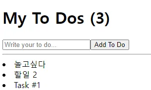
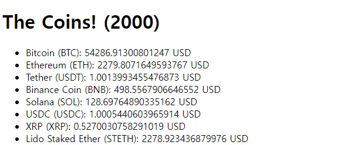

노마드 코더님의 [ReactJS로 영화 웹 서비스 만들기](https://nomadcoders.co/react-for-beginners/)를 들으며 방학동안 리액트 기본문법을 배운 후 이번주는 Todo리스트, 코인 트래커를 따라 만들어보았습니다. 

원래는 영화 서비스 페이지도 클론코딩해볼 계획이였으나, 개강 첫주라 시간이 부족했었습니다. 또한 전체적인 학습 계획을 조금 수정해보았습니다. 

[README.md](https://github.com/karpitony/9oormthonUniv-React-Study/blob/main/README.md)에 주차별로 어떤 내용을 배울지 업데이트 해봤습니다.

<br>

1. [**To do 리스트를 만들며**](#to-do-리스트를-만들며)
    1. [리액트의 useState() 함수](#1-리액트의-usestate-함수)
    2. [`.map()`함수와 `...` 문법](#2-map함수와--문법)
2. [**Coin Tracker를 만들며**](#coin-tracker를-만들며)
    1. [리액트의 `useEffect()` 함수](#1-리액트의-useeffect-함수)
    2. [Javascript 삼항 연산자](#2-javascript-삼항-연산자)
    3. [`fetch().then()` 문법](#3-fetchthen-문법)

<hr>

## `To do 리스트`를 만들며


```js
import { useState } from "react";

function App() {
  const [toDo, setToDo] = useState("");
  const [toDos, setToDos] = useState([]);
  const onChange = (event) => setToDo(event.target.value);
  const onSubmit = (event) => {
    event.preventDefault();
    if (toDo === "") {
      return;
    }
    setToDos((currentArray) => [toDo, ...currentArray]);
    setToDo("");
  };
  return (
    <div>
      <h1>My To Dos ({toDos.length})</h1>
      <form onSubmit={onSubmit}>
        <input 
          onChange={onChange}
          value={toDo}
          type="text" 
          placeholder="Write your to do..." 
        />
        <button>Add To Do</button>
      </form>
      <hr />
      {toDos.map((item, index) => (
        <li key={index}>{item}</li>
      ))};
    </div>
  );
};

export default App;
```

> **배운 것들**
> 1. 리액트의 `useState()`함수 
> 2. `.map()`함수와 `...` 문법

<br>

### 1. 리액트의 `useState()` 함수
#### 사용 방법
`[현재 state, state 를 변경하기 위한 함수]` 두개의 리턴값을 가진다.

```js
const [anyVar, setAnyVar] = useState();
```

위와 같이 사용하며, `anyVar`가 현재 state, `setAnyVar`가 이 state를 변경할 때 사용하는 함수이다.

또한 `useState()` 안에 파라미터로 초기값을 넣어줄 수 있으며, 그 **초기값이 빈 배열도 가능**하다.

<br>

#### 왜 쓰는가
`useState()`를 사용하는 이유는 **상태 관리를 쉽게 하기 위해서**이다.

기존의 JS코드의 경우 간단한 counter를 만든다고 할 때, 한번 숫자를 증가시키기 위한 과정이 복잡하며, 페이지 전체를 다시 로딩해야 할수도 있다. 

하지만, 리액트의 `useState()`함수를 사용하게 되면 값이 변하는 부분만 업데이트되므로 전체 페이지를 다시 렌더링할 필요가 없다. 

이는 웹페이지의 성능을 높이고, 코드 작성 및 유지보수를 더 쉽게 해준다.

<br>

### 2. `.map()`함수와 `...` 문법
#### `.map()`함수에 대하여
`.map()`함수는 반복되는 컴포넌트를 렌더링하기 위한 자바스크립한의 배열 내장 함수이다. 

파라미터로 전달된 함수를 사용하여 배열 내 각 요소를 원하는 규칙에 따라 변환한 후 새로운 배열을 생성한다.

```js
    {toDos.map((item, index) => (
        <li key={index}>{item}</li>
    ))};
```

위 코드에서 볼수 있듯 `.map()`함수 안에 화살표 함수를 사용하였다.

이때 사용한 화살표 함수는 각 배열의 item과, index를 인자로 받아서 인덱스는 key로, 아이템은 `<li>`태그 안에 넣어서 목록으로 만든다.


To do 리스트의 할일 목록을 렌더링 할 때 사용하였다.

<br>

#### `...` 문법
```py
arr = [0, 1]
arr2 = [2, 3]

print(arr.append(arr2))
>>> [0, 1, [2, 3]]

print(arr.extend(arr2))
>>> [0, 1, 2, 3]
```
`Python`의 경우 `.append()`함수는 배열 안에 배열을 넣어 2차원 배열을 만드는데, 

한 배열에 특정 배열을 붙여서 늘리고 싶으면 `.append()`함수가 아닌 `.extend()`함수를 사용한다.

```js
const [toDos, setToDos] = useState([]);
...
setToDos((currentArray) => [toDo, ...currentArray]);
```
JavaScript의 경우 `...`을 통해 파이썬의 `.extend()`함수처럼 손쉽게 배열을 늘릴 수 있다. 

위 코드는 기존 `currentArray`에 새로운 `toDO`를 더한 배열을 만든 뒤,`setToDos`라는 state를 변경하는 함수를 호출해서 `toDos` 배열을 업데이트 한다.

<br>

## `Coin Tracker`를 만들며



```js
import { useEffect, useState } from "react";

function App() {
  const [loading, setLoading] = useState(true);
  const [coins, setCoins] = useState([]);
  useEffect(() => {
    fetch("https://api.coinpaprika.com/v1/tickers")
    .then((response) =>  response.json())
    .then((json) => {
      setCoins(json);
      setLoading(false);
    });
  }, []);
  return (
    <div>
      <h1>The Coins! {loading ? "" : `(${coins.length})`}</h1>
      {loading ? <strong>Loading...</strong> : null}
      <ul>
        {coins.map((coin) => (
          <li>
            {coin.name} ({coin.symbol}): {coin.quotes.USD.price} USD
          </li>
        ))};
      </ul>
    </div>
  );
};

export default App;
```

> **배운 것들**
> 1. 리액트의 `useEffect()`함수
> 2. Javascript 삼항연산자
> 3. `fetch().then()` 문법

### 1. 리액트의 `useEffect()` 함수
```js
useEffect(() => {
    fetch("https://api.coinpaprika.com/v1/tickers")
    .then((response) =>  response.json())
    .then((json) => {
      setCoins(json);
      setLoading(false);
    });
  }, []);
```
useEffect()는 리액트에서 컴포넌트가 렌더링될 때 특정 코드를 실행하기 위해 사용하는 함수이다. 

주로 데이터를 가져오거나, 타이머 설정, DOM 조작 등 부수적인 효과를 처리하는 데 사용된다. 

위 코드에서는 fetch()를 통해 코인 데이터를 가져오는 과정에서 **한 번만 실행되도록 설정하기 위해 빈 배열 []을** 두 번째 인자로 넘겼다. 

이는 컴포넌트가 처음 렌더링될 때 한 번만 실행되도록 하며, 특정 상태나 값이 변경될 때만 다시 실행하도록 설정할 수도 있다.

<br>

### 2. Javascript 삼항 연산자

삼항 연산자는 `조건 ? 참일 때 실행될 코드 : 거짓일 때 실행될 코드` 형태로, 조건에 따라 실행할 코드를 간결하게 작성할 수 있는 문법이다. 

위 코드에서는 로딩 중일 때와 그렇지 않을 때를 구분해 화면에 출력할 내용을 제어한다.

```js
<h1>The Coins! {loading ? "" : `(${coins.length})`}</h1>
```

위의 코드는 로딩 중이라면 빈 문자열을 반환하고, 로딩이 끝나면 코인 개수를 보여주는 기능을 한다.

이처럼 짧고 간단단게 조건문을 구현할 때 유용하다.

<br>

### 3. `fetch().then()` 문법
`fetch()`는 웹 API로부터 데이터를 가져오기 위한 비동기 함수로, `then()`을 사용해 데이터를 성공적으로 가져온 후 처리할 코드를 작성할 수 있다.

비동기 작업의 결과가 준비되었을 때 실행되는 콜백 함수를 연결하여 데이터를 처리한다. 

```js
fetch("https://api.coinpaprika.com/v1/tickers")
  .then((response) =>  response.json())
  .then((json) => {
    setCoins(json);
    setLoading(false);
});
```

위 코드에서는 코인 정보를 제공하는 API로부터 데이터를 가져온 후 `then()`을 통해 JSON 형식으로 변환하고, 해당 데이터를 `setCoins()`를 통해 상태에 저장한 후, `setLoading(false)`를 호출해 로딩 상태를 해제한다. 

비동기적인 데이터 처리와 상태 업데이트를 매우 간단하게 구현할 수 있는 방법이다.

