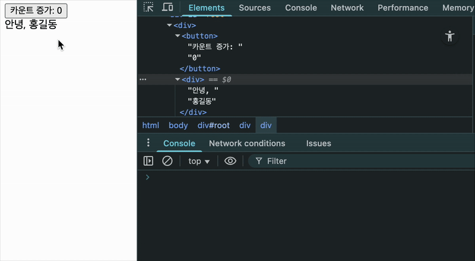
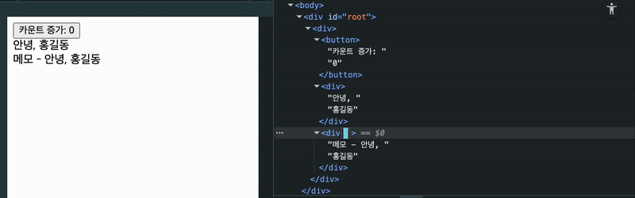
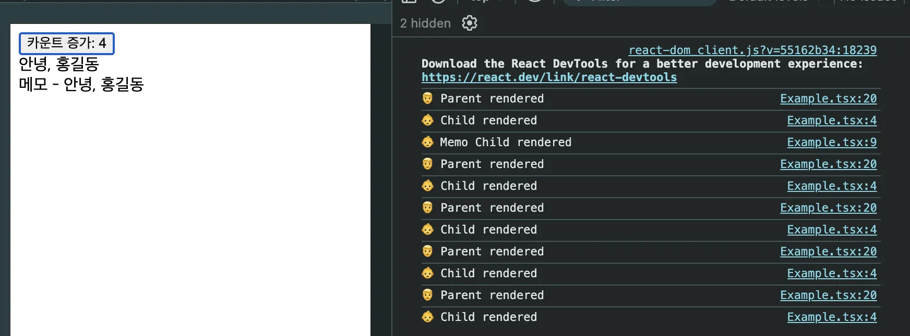
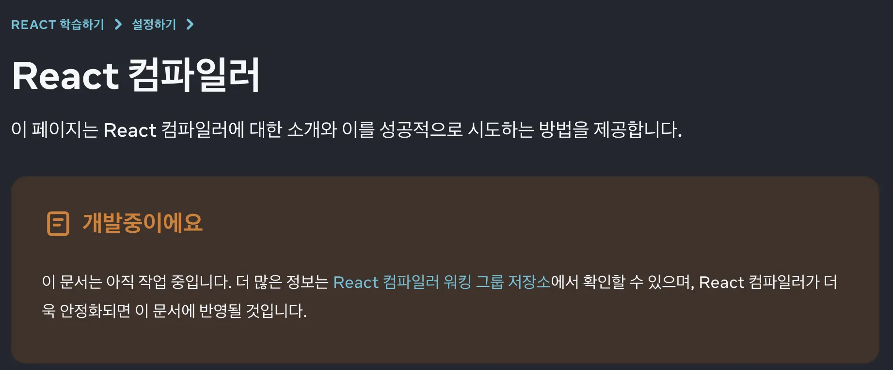

리액트 렌더링 최적화에 대해 공부하며,

> - 리액트 컴포넌트의 리렌더링 조건
> - 리액트의 리렌더링 ≠ DOM 업데이트
> - 불필요한 리렌더링 방지 방법

를 공부하면서 이해한 내용을 정리해보았습니다.

## 1. 리액트의 컴포넌트 리렌더링 조건

리액트 컴포넌트는 다음과 같은 경우에 리렌더링됩니다.

**1. `state`가 업데이트 된 경우**  
컴포넌트 내부에서 useState 또는 useReducer를 통해 관리하는 상태가 변경되면, 해당 컴포넌트는 다시 렌더링됩니다.

**2. `context`가 업데이트된 경우**
리액트의 `Context API`를 사용하면, 여러 컴포넌트 간에 상태를 전역적으로 공유할 수 있습니다.
이때, `Context`의 값이 변경되면 이를 구독하고 있는 모든 컴포넌트가 리렌더링됩니다.

**3. 커스텀 훅 내부의 `state` 또는 `context`가 업데이트된 경우**
리액트는 커스텀 훅 내부의 `useState`, `useReducer`, `useContext`도 일반 훅처럼 동작합니다.
커스텀 훅이 값을 변경하면 이를 사용하는 컴포넌트는 훅 내부의 상태 변화 때문에 리렌더링됩니다.

**4. 부모 컴포넌트가 리렌더링된 경우**
부모 컴포넌트가 리렌더링되면, JSX 내부에 있는 자식 컴포넌트들도 다시 호출됩니다.
비록 자식 컴포넌트가 동일한 props를 받더라도, 기본적으로는 다시 렌더링됩니다.

1~3번의 경우는 내부 상태(state)가 변경되었기 때문에 해당 컴포넌트가 다시 렌더링되는 것으로 이해할 수 있습니다.

하지만, 4번처럼 부모 컴포넌트가 리렌더링될 때, 왜 자식 컴포넌트도 함께 리렌더링되는지 의문이 들었습니다.

### 왜 자식 컴포넌트가 리렌더링 되는가

리액트는 UI를 함수의 반환값으로 바라보는 선언형 UI 라이브러리입니다.

즉, 화면은 함수가 주어진 props와 state에 따라 **계산된 결과**입니다.

따라서 컴포넌트를 렌더링하는 것은 그 함수를 다시 실행하는 것이며, 이때 포함된 자식 컴포넌트(함수)들도 함께 다시 호출됩니다.

> 리액트는 이전 UI를 **기억**하지 않고, 항상 현재 상태에 맞는 UI를 계산해 다시 그립니다.
> 즉, 전체 UI를 다시 계산하는 방식을 기본으로 합니다.

부모 컴포넌트가 리렌더링되면 그 안의 JSX도 다시 계산되며, 이때 자식 컴포넌트는 이전과 동일한 props를 받더라도 기본적으로 다시 렌더링됩니다.

이것은 리액트가, **UI의 정합성을 보장하고**, **복잡한 조건을 추적하는 대신 일관된 렌더링 흐름을 유지하기 위해**, **“모든 걸 다시 계산한 다음, 변경된 부분만 DOM에 반영"**하는 방식을 채택했기 때문입니다.

## 2. 리렌더링은 DOM 업데이트가 아니다.

리액트에서 말하는 리렌더링은 **DOM 업데이트를 의미하지 않습니다.**

리액트는 컴포넌트 트리를 다시 실행해 **새로운 UI 구조를 계산(render)** 하고, 그 결과를 **가상 DOM** 에 반영합니다.

그 다음, 이전 가상 DOM과 비교하여 차이를 계산(diffing)하고, 변경된 부분만 **실제 브라우저의 DOM에 업데이트(commit)** 합니다.

변경점이 없다면 커밋 단계에서 아무 작업도 일어나지 않으므로, 리렌더링이 일어나도 실제 DOM 업데이트는 발생하지 않습니다.

예제 코드와 GIF로 직접 확인해보면,

```tsx
import { useState } from 'react';

const Child = ({ user }: { user: { name: string } }) => {
  console.log('👶 Child rendered');
  return <div>안녕, {user.name}</div>;
};

export default function Parent() {
  const [count, setCount] = useState(0);
  const user = { name: '홍길동' };
  console.log('👨 Parent rendered');

  return (
    <div>
      <button onClick={() => setCount(c => c + 1)}>카운트 증가: {count}</button>
      <Child user={user} />
    </div>
  );
}
```

상태가 없는 자식 컴포넌트와, 버튼 클릭시 1씩 증가하는 상태를 가진 부모 컴포넌트가 있습니다.

버튼이 눌려 부모컴포넌트의 상태가 바뀌면, 부모 컴포넌트는 리렌더링 되고, 자식 컴포넌트도 같이 리렌더링 될것입니다.

하지만, 자식컴포넌트는 바뀐 것이 없으므로, 리렌더링 되더라도 DOM은 업데이트 되지 않을것입니다.



버튼을 누르면 부모와 자식 컴포넌트가 리렌더링 되어 `console.log('👨 Parent rendered')`와 `console.log('👶 Child rendered')`이 실행되어서 콘솔에 출력되는 것을 볼 수 있습니다.

하지만, HTML ELEMENT에선 숫자만 바뀔 뿐, 나머지 DOM 노드는 변경되지 않습니다.

가상 DOM 덕분에 많은 컴포넌트를 다시 실행해도, 실제 DOM 조작은 최소화되어 성능 손실을 줄일 수 있습니다.

그러나, 컴포넌트 트리가 복잡해지면 불필요한 리렌더링으로 CPU를 낭비할 수 있으니, 메모지에이션을 통해 연산을 줄이는 방법이 필요합니다.

## 3. 리액트 렌더링 최적화가 필요한 이유

리액트의 함수형 컴포넌트는 **리렌더링될 때마다 컴포넌트 함수 전체를 다시 실행합니다.**

즉, 컴포넌트 안에 작성된 모든 JS 로직이 재실행되고, 렌더링 로직에 포함된 비싼 계산이 반복 수행되는 셈입니다.

```tsx
function Parent() {
  const [count, setCount] = useState(0);
  console.log('Parent 렌더링');

  // 매우 비용이 큰 계산 함수 (예: 복잡한 루프, 암호화 등)
  const result = heavyComputation(count);

  return (
    <div>
      <button onClick={() => setCount(c => c + 1)}>카운트 증가: {count}</button>
      <p>계산 결과: {result}</p>
    </div>
  );
}
```

버튼 클릭으로 `count`가 바뀔때마다, `Parent`가 리렌더링되고, `heavyComputation`도 매번 실행되며 화면 업데이트 비용 외에 계산 비용까지 누적됩니다.

### 3.1. React.memo로 불필요한 리렌더링 막기

`React.memo`는 컴포넌트를 props가 바뀌지 않으면 리렌더링하지 않도록 메모이제이션합니다.

아래 코드를 통해 동작 방식을 살펴보겠습니다.

```tsx
import { memo, useMemo, useState } from 'react';

const Child = ({ user }: { user: { name: string } }) => {
  console.log('👶 Child rendered');
  return <div>안녕, {user.name}</div>;
};

const MemoChild = memo(({ user }: { user: { name: string } }) => {
  console.log('👶 Memo Child rendered');
  return <div>메모 - 안녕, {user.name}</div>;
});

export default function Parent() {
  const [count, setCount] = useState(0);

  const user = useMemo(() => {
    return { name: '홍길동' };
  }, []); // 의존성 배열이 있음

  console.log('👨 Parent rendered');

  return (
    <div>
      <button onClick={() => setCount(c => c + 1)}>카운트 증가: {count}</button>
      <Child user={user} />
      <MemoChild user={user} />
    </div>
  );
}
```

**1. 초기 렌더링**

- `Parent` 컴포넌트가 렌더링되며 `console.log('👨 Parent rendered')` 실행
- `Child, MemoChild` 모두 호출되며 각각 `console.log('👶 ... rendered')` 출력

**2. 버튼 클릭 → `count` 증가**

- `setCount`가 호출되며 `Parent` 리렌더링
- `Child`는 항상 함수가 다시 실행되므로 무조건 다시 렌더링됨
- `MemoChild`는 user 객체의 참조가 변하지 않았기 때문에 리렌더링되지 않음




### 3.2. useMemo로 객체 재생성 막기

리액트 컴포넌트에 props로 **객체를 전달할 때**, 해당 객체가 매번 새로 생성된다면 `React.memo`는 이전 props와 비교해도 매번 다르다고 판단해 리렌더링을 막지 못합니다.

이를 방지하기 위해 `useMemo`를 사용해 객체 생성을 메모이제이션하면 됩니다.

```tsx
const user = useMemo(() => {
  return { name: '홍길동' };
}, []);
```

이렇게 하면 user 객체는 `[]` 의존성 배열이 바뀌지 않는 한 같은 참조를 유지하게 됩니다.

### 3.3. useCallback으로 함수 재생성 막기

함수 또한 props로 자식 컴포넌트에 전달할 때 주의가 필요합니다.

함수는 **컴포넌트가 리렌더링될 때마다 새로운 참조로 생성되기 때문**에, `React.memo`된 자식 컴포넌트에서 props가 변경된 것으로 판단해 리렌더링이 발생합니다.

```tsx
const handleClick = () => {
  console.log('clicked');
};
```

이 코드는 매 렌더링마다 새로운 함수가 생성됩니다.

이를 방지하려면 `useCallback`을 사용해 함수를 메모이제이션해야 합니다.

```tsx
const handleClick = useCallback(() => {
  console.log('clicked');
}, []);
```

이제 `handleClick`은 의존성이 바뀌지 않는 한 같은 참조를 유지합니다.

### 3.4 리액트 컴파일러



> - [리액트 공식문서](https://ko.react.dev/learn/react-compiler)

일일이 메모이제이션이 필요한 부분에 `useMemo`, `useCallback`, `React.memo` 를 적용하는 것은 귀찮고, 놓칠수도 있습니다..

**React 컴파일러**는 리액트 앱의 성능을 자동으로 최적화하는 빌드 타임 도구입니다.

수동으로 `useMemo`, `useCallback`, `React.memo` 등을 사용하는 대신, 컴파일러가 자동으로 적절한 메모이제이션을 적용해 줍니다.

- React 규칙을 분석해 컴포넌트와 Hook 내부의 값을 자동 메모이제이션.
- 컴파일 타임에 작동하며, 앱의 불필요한 리렌더링을 줄여 성능 향상.
- 규칙 위반 시 해당 컴포넌트는 자동으로 최적화 대상에서 제외.

리액트 컴파일러는 지금 베타 단계이지만 조만간 안정버전이 나온다면 더이상 개발자가 메모이제이션을 관리하지 않고 개발을 할 수 있을 것입니다.
