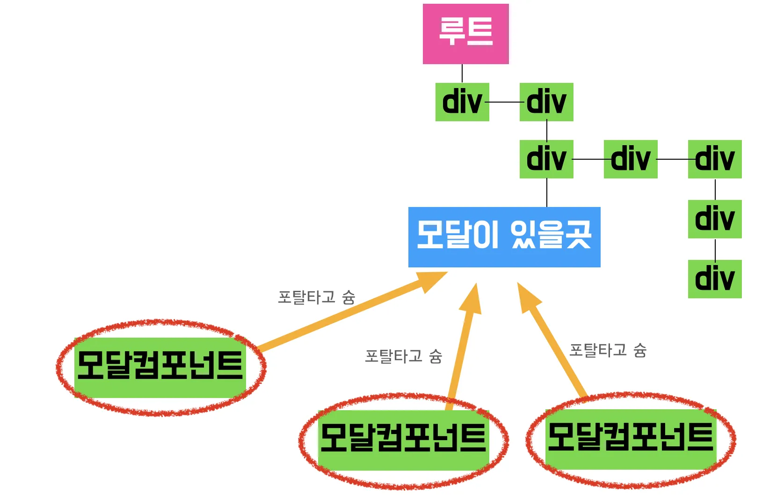
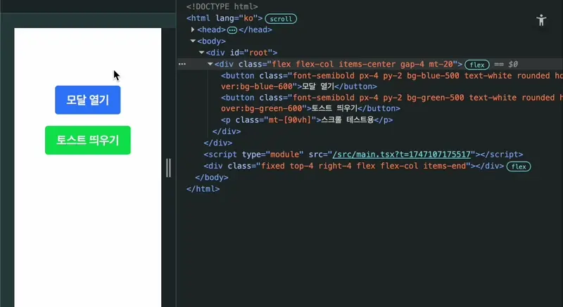
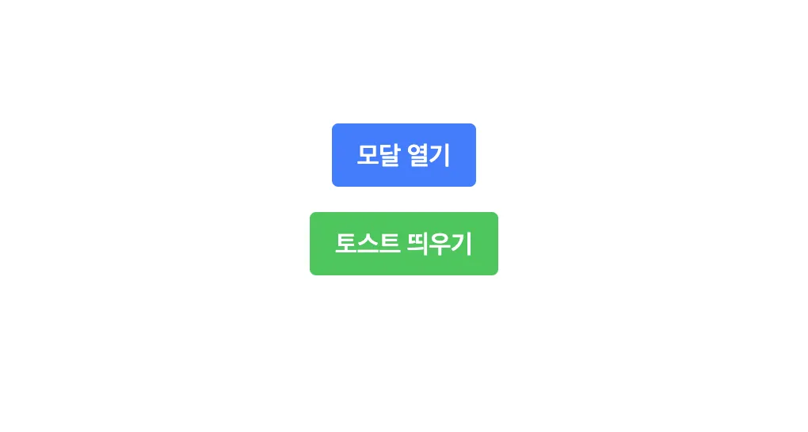
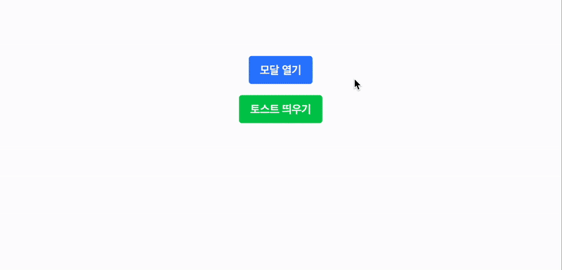
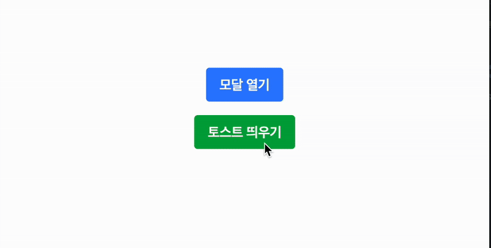

## "제대로 구현한다"는 무엇을 의미할까

**모달**이나 **토스트** UI는 리액트에서 자주 사용되지만, 막상 직접 구현해보면 구조가 꼬이거나 이상하게 동작하는 경우가 많습니다.

`useState`와 `z-index`만으로 간단하게 만들 수 있지만, 구현 과정에서 다음과 같은 문제들을 겪게 됩니다.

- 부모 컴포넌트의 `overflow: hidden`에 가려 보이지 않음
- `z-index`가 꼬여서 겹치는 UI 위에 뜨지 않음
- 위치가 의도한 곳이 아니라 이상한 DOM 위치에 붙음
- 외부 영역 클릭이나 ESC 키로 닫히지 않음
- 포커스가 모달 내부에 갇히지 않거나, 아예 이동되지 않음
- 스크린리더가 모달 내부를 제대로 읽지 못함

동작할 뿐만 아니라 **UX**, **접근성**, **이벤트 처리**까지 고려되어야 합니다.

이런 문제들을 하나씩 해결하다 보면 코드가 복잡해지고, 재사용하기도 어려워집니다.

이 글에서는 이런 문제들을 구조적으로 해결하기 위해 `ReactDOM.createPortal`을 활용해 모달과 토스트를 제대로 구현하는 방법을 소개합니다.

---

## 왜 Portal이 필요할까요?

기본적으로 모달이나 토스트는 앱의 루트 구조를 벗어난 곳에 렌더링되어야 레이아웃이나 스타일 충돌을 방지할 수 있습니다. 일반적으로 모달은 **조건부 렌더링** + **z-index** 조합으로 많이 구현합니다.

```tsx
return (
  <div className="App">
    <Header />
    <Main />
    {isModalOpen && <Modal isOpen={isModalOpen} onClose={() => setModalOpen(false)} />}
  </div>
);
```

이런 방식은 `Modal`이 `App` 내부에 렌더링되기 때문에, `overflow`, `z-index`, `position` 등 부모 DOM의 스타일 속성에 직접적인 영향을 받을 수 있어, UI가 의도와 다르게 렌더링될 수 있습니다.

따라서 모달은 DOM 구조상으로도 별도로 분리되어야 하고, 그 역할을 수행해주는 것이 바로 `createPortal`입니다.



> 이미지 출처: https://joong-sunny.github.io/react/react3/#createportal

Portal을 사용하면 React 컴포넌트를 다른 DOM 위치에 이동시키는 렌더링이 가능합니다.

위 사진처럼 기본 DOM에 특정 위치로 포탈을 열고 컴포넌트롤 보내어 기존 DOM 구조와 분리시킬 수 있습니다.



모달창을 누르면 HTML의 `<body>`안에 모달창이 생기는 것을 볼 수 있습니다.

`createPortal`을 사용하면 모달을 `document.body` 아래에 직접 렌더링할 수 있어, 이런 스타일 제약으로부터 독립적인 레이어를 만들 수 있습니다.

### createPortal 기본 예제

`createPortal(children, container)`

- `children`: 렌더링할 React 엘리먼트
- `container`: React 트리 외부에 있는 DOM 요소 (예: `document.getElementById("modal-root")`)

```tsx
import { createPortal } from 'react-dom';
// ...
return createPortal(<div className="modal">내용</div>, document.body);
```

### 웹 접근성 향상

모달은 사용자 인터페이스의 중요한 부분으로, 스크린 리더 사용자나 키보드 네비게이션 사용자에게도 적절하게 제공되어야 합니다.

`createPortal`을 사용하면 모달을 DOM의 루트 수준에 렌더링하고, `role="dialog"`와 `aria-modal="true"` 같은 ARIA 속성을 적용해 스크린 리더에게 모달의 의미를 정확히 전달하는 일은 중요합니다.

MDN의 [ARIA: dialog role](https://developer.mozilla.org/en-US/docs/Web/Accessibility/ARIA/Reference/Roles/dialog_role) 문서에 따르면, `Dialog`는 페이지 콘텐츠의 최상단에 위치해야 하며, 다른 웹페이지 요소와 분리된 UI여야 한다고 합니다.

> "The `dialog` role is used to mark up an HTML based application dialog or window that separates content or UI from the rest of the web application or page. Dialogs are generally placed on **top of the rest of the page content** using an overlay."[MDN Web Docs](https://developer.mozilla.org/en-US/docs/Web/Accessibility/ARIA/Reference/Roles/dialog_role)

또한, [aria-modal](https://developer.mozilla.org/en-US/docs/Web/Accessibility/ARIA/Attributes/aria-modal) 속성에 대해서는, 스크린리더에게 모달이 활성화 되어있는 동안 모달 아래 요소들은 활성화 되어있지 않다고 말해줍니다.

> "`aria-modal='true'` tells assistive technologies that the windows underneath the current dialog are not part of the modal content."[MDN Web Docs](https://developer.mozilla.org/en-US/docs/Web/Accessibility/ARIA/Attributes/aria-modal)

이러한 ARIA 속성들이 제대로 동작하려면 모달이 DOM 트리의 루트 수준, 예컨대 `<body>` 바로 아래에 있어야 합니다.

그렇지 않으면 부모 요소의 레이아웃이나 접근성 맥락에 의해 무시되거나 왜곡될 수 있습니다.

### 포커스 트랩 구현에서 `createPortal`의 장점

MDN의 [aria-modal](https://developer.mozilla.org/en-US/docs/Web/Accessibility/ARIA/Attributes/aria-modal) 문서에 따르면 모달이 보일 동안 포커스는 모달 안에 "갖혀있어야" 한다고 합니다.

> "When a modal element is displayed, focus should be placed in the modal. Focus needs to be 'trapped' inside the modal when it is visible, until it is dismissed."

또한, [ARIA: dialog role](https://developer.mozilla.org/en-US/docs/Web/Accessibility/ARIA/Reference/Roles/dialog_role) 문서에서는 Dialog(모달)이 나타나면, 키보드 포커스가 자동으로 모달 안으로 이동해야 하며, 모달이 닫히면 다시 자동으로 원래 있던 곳으로 돌아가야 한다고 합니다.

> "When the dialog appears on the screen, keyboard focus should be moved to the default focusable control inside the dialog... After the dialog is dismissed, keyboard focus should be moved back to where it was before it moved into the dialog."

모달이 부모 컴포넌트 안에 있을 경우, 자식 요소들의 `tabindex`, focusable element 등을 예측하기 어렵고, 모달 외부 요소가 계속 렌더되고 있어 포커스를 유출하기 쉬워집니다.

`createPortal`로 DOM 루트에 렌더링하면, 포커스 관리가 단순해지고 키보드 내비게이션 사용자에게 훨씬 나은 경험을 제공할 수 있습니다.

따라서, **`createPortal`을 사용하여 모달을 DOM의 루트 수준에 렌더링함**으로써, **ARIA 속성들이 효과적으로 적용**되고, **스크린 리더 사용자에게 모달의 의미가 정확히 전달** 될 수 있습니다.

> 웹접근성에 대해 좀더 알아보고 싶으면 [WAI-ARIA Modal Authoring Practices](https://www.w3.org/WAI/ARIA/apg/patterns/dialog-modal/)을 참고해보면 좋습니다.

---

## 컴포넌트별 구현 전략



컴포넌트를 테스트 하기 위해 각각의 트리커 버튼을 만들었고, 토스트의 경우 숫자 카운터 로직도 넣었습니다.

```tsx
import { useRef, useState } from 'react';
import Modal from './components/Modal';
import ToastContainer, { ToastItem } from './components/ToastContainer';

export default function App() {
  const [isModalOpen, setModalOpen] = useState(false);
  const [toasts, setToasts] = useState<ToastItem[]>([]);
  const [counter, setCounter] = useState(0);
  const toastId = useRef(0);

  const showToast = (message: string) => {
    setToasts(prev => [...prev, { id: ++toastId.current, message }]);
  };

  const handleToastClose = (id: number) => {
    setToasts(prev => prev.filter(toast => toast.id !== id));
  };

  return (
    <div className="...">
      <button className="..." onClick={() => setModalOpen(true)}>
        모달 열기
      </button>
      <button
        className="..."
        onClick={() => {
          setCounter(prev => prev + 1);
          showToast(`안녕하세요! ${counter}번 토스트입니다.`);
        }}
      >
        토스트 띄우기
      </button>

      <Modal open={isModalOpen} onClose={() => setModalOpen(false)} />
      <ToastContainer toasts={toasts} onClose={handleToastClose} closeDelay={2000} />
    </div>
  );
}
```

TailwindCSS는 불필요하여 가려놓았습니다. 모달을 표시할 `<Modal />` 컴포넌트와 토스트들을 묶어 보여줄 `<ToastContainer />` 컴포넌트를 불러와서 DOM 트리 안에 넣었습니다.

다만, 두 컴포넌트들은 `createPortal`을 사용하므로 렌더링은 해당 위치에서 이루어지지 않습니다. 프롭과 상태 정보 등만 공유합니다.

### 1. 모달 (Modal)



모달 버튼을 클릭하면, 모달이 기존 요소 위에 뜹니다. 해당 모달 컴포넌트를 만들 때, `z-index` 옵션은 사용하지 않았습니다.

```tsx
import { createPortal } from 'react-dom';

function Modal({ open, onClose }) {
  if (!open) return null;
  return createPortal(
    <div className="...">
      <div className="...">
        <h2 className="...">모달창!</h2>
        <p className="...">createPortal로 만든 모달창입니다.</p>
        <button className="..." onClick={onClose}>
          닫기
        </button>
      </div>
    </div>,
    document.body,
  );
}

export default Modal;
```

`createPortal`을 사용해 모달을 만들었습니다. 또한 `document.body`를 포탈 함수의 두번째 인자로 넣어주어 DOM의 body 바로 아래에 렌더링되게끔 할 수 있습니다.

웹 접근성을 위해 포커스 이동, ESC키로 모달 닫기, `role="dialog"`, `aria-modal="true"` 추가해보면,

```ts
// hooks/useScrollLock.ts
import { useLayoutEffect } from 'react';

export const useScrollLock = (open: boolean) => {
  useLayoutEffect(() => {
    if (!open) return;
    const originalStyle = window.getComputedStyle(document.body).overflow;
    document.body.style.overflow = 'hidden';
    return () => {
      document.body.style.overflow = originalStyle;
    };
  }, [open]);
};
```

```tsx
// components/Modal.tsx
import { useEffect, useRef } from 'react';
import { createPortal } from 'react-dom';
import { useScrollLock } from '../hooks/useScrollLock';

function Modal({ open, onClose }: ModalProps) {
  const modalRef = useRef<HTMLDivElement>(null);
  const closeButtonRef = useRef<HTMLButtonElement>(null);

  useScrollLock(open);

  useEffect(() => {
    if (!open) return;

    const focusableElements = modalRef.current?.querySelectorAll(
      'button, [href], input, select, textarea, [tabindex]:not([tabindex="-1"])',
    ) as NodeListOf<HTMLElement>;

    const first = focusableElements?.[0];
    const last = focusableElements?.[focusableElements.length - 1];

    const handleKeyDown = (e: KeyboardEvent) => {
      if (e.key === 'Escape') {
        onClose();
      }

      if (e.key === 'Tab' && first && last) {
        if (!e.shiftKey && document.activeElement === last) {
          e.preventDefault();
          first.focus();
        } else if (e.shiftKey && document.activeElement === first) {
          e.preventDefault();
          last.focus();
        }
      }
    };

    document.addEventListener('keydown', handleKeyDown);
    closeButtonRef.current?.focus();

    return () => {
      document.removeEventListener('keydown', handleKeyDown);
    };
  }, [open, onClose]);

  if (!open) return null;

  return createPortal(
    <div
      ref={modalRef}
      role="dialog"
      aria-modal="true"
      aria-labelledby="modal-title"
      aria-describedby="modal-desc"
      className="..."
      onClick={(e: React.MouseEvent) => {
        if (e.target === e.currentTarget) onClose();
      }}
    >
      <div className="...">
        <h2 id="modal-title" className="...">
          모달창!
        </h2>
        <p id="modal-desc" className="...">
          createPortal로 만든 웹 접근성 고려 모달입니다.
        </p>
        <button ref={closeButtonRef} onClick={onClose} className="...">
          닫기
        </button>
      </div>
    </div>,
    document.body,
  );
}

export default Modal;
```

이런 형식으로 모달창 구성이 가능합니다.

### 2. 토스트 (Toast)



토스트도 마찬가지로 DOM 상에서 고정된 위치(Ex. `body` 우측 상단)에 떠야 하므로, Portal을 사용하는 것이 유리합니다.

여러 개의 토스트가 쌓이는 경우를 고려해, 컨테이너 컴포넌트를 만들어 아래처럼 구성할 수 있습니다.

```tsx
// components/ToastContainer.tsx
import { createPortal } from 'react-dom';
import Toast from './Toast';

function ToastContainer({ toasts, onClose, closeDelay }) {
  return createPortal(
    <div className="...">
      {toasts
        .slice()
        .reverse()
        .map(toast => (
          <Toast
            key={toast.id}
            open={true}
            message={toast.message}
            onClose={() => onClose(toast.id)}
            closeDelay={closeDelay}
          />
        ))}
    </div>,
    document.body,
  );
}

export default ToastContainer;
```

```tsx
// components/Toast.tsx
import { useEffect } from 'react';

function Toast({ open, message, onClose, closeDelay = 2000 }) {
  useEffect(() => {
    if (open) {
      const timer = setTimeout(onClose, closeDelay);
      return () => clearTimeout(timer);
    }
  }, [open, onClose, closeDelay]);

  if (!open) return null;
  return (
    <div className="...">
      <span>{message}</span>
      <button className="..." onClick={onClose} aria-label="닫기">
        ×
      </button>
    </div>
  );
}

export default Toast;
```

토스트는 단일 토스트 컴포넌트와, 토스트들을 모아서 보여줄 컨테이너 컴포넌트 두개를 만들었습니다. 단일 토스트 컴포넌트에 타이머를 추가하여 2초 뒤 사라지게 했습니다.

컨테이너 컴포넌트를 `createPortal()`로 감싸서 `document.body`에 렌더링 시켰습니다. 토스트들이 `z-index`없이도 페이지 위에 오버레이되며, 별도의 레이아웃 시프트 없이 부드럽게 작동합니다.

> 스타일링된 코드와 전체 소스코드가 궁금하시면 깃허브 레포지토리에 올려놨으니 한번 확인해보세요. <br>
> https://github.com/karpitonys-stash/example-createPortal

---

## 마무리

모달과 토스트는 단순한 UI처럼 보이지만, 레이어 구조, 이벤트 핸들링, 접근성 등 다양한 요소가 얽힌 복합적인 UI입니다.

이 글에서 소개한 방식처럼 `createPortal`을 기반으로 하고, 접근성과 구조를 함께 고려해 설계하면 더 견고하고 확장성 있는 UI를 만들 수 있습니다.

직접 구현이 귀찮거나 접근성 등까지 고려하기 어렵다면 다음 라이브러리들도 있으니 사용해도 편할 것 같습니다.

- **Radix UI** – 접근성까지 고려된 저수준 컴포넌트
- **Headless UI** – 스타일 없는 UI 로직 컴포넌트
- **React Aria** – Adobe 제작, 완전 접근성 중심
