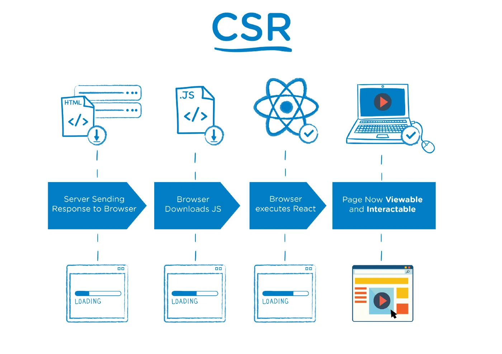

## 1. React는 라이브러리일 뿐이다.

React는 어디까지나 UI를 만들기 위한 라이브러리입니다. “View만 책임진다”는 철학 덕분에 자유롭고 유연하지만, 그만큼 개발자가 직접 구축해야 할 것들이 많습니다.

- 라우팅은 `react-router`로 별도 구성해야 하고
- 상태 관리는 `Redux`, `Recoil`, `Zustand` 등 외부 도구에 의존하고
- API 통신과 서버 연동은 `Axios` 혹은 `Tanstack Query`로 전부 수동 처리해야 합니다.
- 직접 코드를 분할하고, 동적으로 import하는 등 수동으로 최적화를 해야합니다.

이러한 구성은 작은 프로젝트에서는 큰 문제가 없지만, 규모가 커질수록 복잡한 설정과 디렉토리 구조가 발목을 잡기 시작합니다.
React 단독 프로젝트는 결국 “제약 없는 자유”의 대가를 치르게 됩니다.


## 2. SPA의 구조적 한계

React로 만든 애플리케이션은 대부분 **SPA(Single Page Application)**입니다. SPA는 사용성 면에서는 유리하지만, 구조적인 한계를 갖고 있습니다.



**CSR(Client-Side Rendering)** 방식은 SEO에 매우 취약합니다. 첫 요청시 아무것도 없는 HTML파일이 오기 때문에, 검색 엔진이 페이지의 내용을 제대로 인식하지 못합니다.

초기 로딩 속도도 문제가 됩니다. 

```text
사용자가 https://***.com에 요청 -> 빈 HTML 도착 ->
JavaScript 번들(chunk) 도착 → React가 실행되며 실제 콘텐츠가 브라우저에 그려짐
```

CSR은 초기 렌더링 시 위와 같은 흐름이 이어집니다.

초기 로딩 속도와 검색 엔진 최적화 문제는 콘텐츠 중심 웹사이트(블로그, 뉴스, 문서 등)는 이런 구조에서 매우 불리합니다.

이러한 이유로 많은 개발자들은 “React는 잘 만들었지만 SPA는 아쉽다”고 말합니다.


## 3. Next.js는 어떤가

Next.js는 React 기반의 프레임워크로, 앞서 언급한 문제들을 명확하게 해결해 줍니다.

- 파일 기반 라우팅으로 라우터 설정을 최소화하고, 명확한 구조를 잡을 수 있습니다.
- 코드 분할, 이미지 최적화, 자동 캐싱 등 성능 최적화 기능을 기본 탑재합니다.
- **SSR(서버 사이드 렌더링)**, **SSG(정적 생성)**, **ISR(점진적 정적 생성)**까지 지원하여 다양한 웹사이트 구조에 적합하게 대응합니다.

> ISR은 빌드 후에도 정적 페이지를 일정 주기마다 업데이트하여 새로 만드는 렌더링 방법으로, 블로그나 뉴스처럼 잦은 콘텐츠 업데이트가 있는 사이트에 적합합니다.

특히 SEO가 중요한 페이지나, 빠른 초기 로딩이 요구되는 경우 Next.js의 렌더링 전략은 확실한 이점을 제공합니다.

### 3.1. 풀스택 프레임워크

Next.js는 단순한 프론트 프레임워크를 넘어, 간단한 서버 역할까지 수행할 수 있는 풀스택 프레임워크입니다.

```ts
// app/api/hello/route.ts
import { NextResponse } from 'next/server';
export async function GET() {
  return Response.json({ message: 'Hello from server!' });
}
```
- `app/` 디렉토리 안에 `route.ts`를 만들면, **Express 없이도 REST API를 구축**할 수 있습니다.
- **Middleware**를 사용하면, 인증 검사, 리다이렉트, 쿠키 처리 등의 작업을 라우팅 전에 처리할 수 있습니다.
- **Server Components**를 사용하면, 클라이언트와 서버의 역할을 분리하면서도 자연스럽게 연동되는 컴포넌트를 만들 수 있습니다.

Next.js가 제공하는 기능 덕분에 프론트엔드 개발자는 브라우저에서 서버까지 유연하게 다룰 수 있습니다.


### 3.2 서버에서 fetch

기존 React 앱에서는 클라이언트에서 API를 호출했기 때문에,
- API 주소가 노출되고,
- 브라우저에서 토큰이 관리되며,
- CORS 문제에 직접 대응해야 했습니다.

즉, 브라우저가 모든 책임을 지는 구조이다 보니, 보안과 유지보수 측면에서 취약한 점이 많습니다.

반면, Next.js에서는 서버에서 API를 호출해 데이터를 가져오고 이를 기반으로 HTML을 생성하기 때문에,

- 민감한 정보를 안전하게 서버에서만 처리할 수 있고,
- 브라우저 환경과 무관하게 외부 API와 통신할 수 있으며,
- **서버의 API 주소나 인증 정보가 클라이언트에 노출되지 않습니다.**
- 렌더링된 데이터가 HTML에 포함되므로 **검색 엔진 최적화(SEO)** 에도 유리합니다.

결과적으로, 보안성과 SEO를 모두 확보하면서도, 별도의 백엔드 서버나 복잡한 인프라 없이도 필요한 서버 작업을 처리할 수 있다는 점이 큰 장점입니다.


## 4. 마무리

Next.js는 React를 기반으로 하면서도, 프레임워크 수준의 구조화와 서버 기능을 제공합니다. 그 결과,

- 더 이상 라우팅, SEO, 데이터 패칭, 서버 구성에 대한 고민을 따로 하지 않아도 되고
- 프로젝트를 체계적으로 설계할 수 있으며
- 프론트엔드 개발자가 백엔드 영역도 일부 다룰 수 있는 유연한 환경이 만들어졌습니다.

Next.js는 팀 단위의 협업이나, 장기적인 유지보수를 고려할 때도 큰 강점을 발휘합니다.
