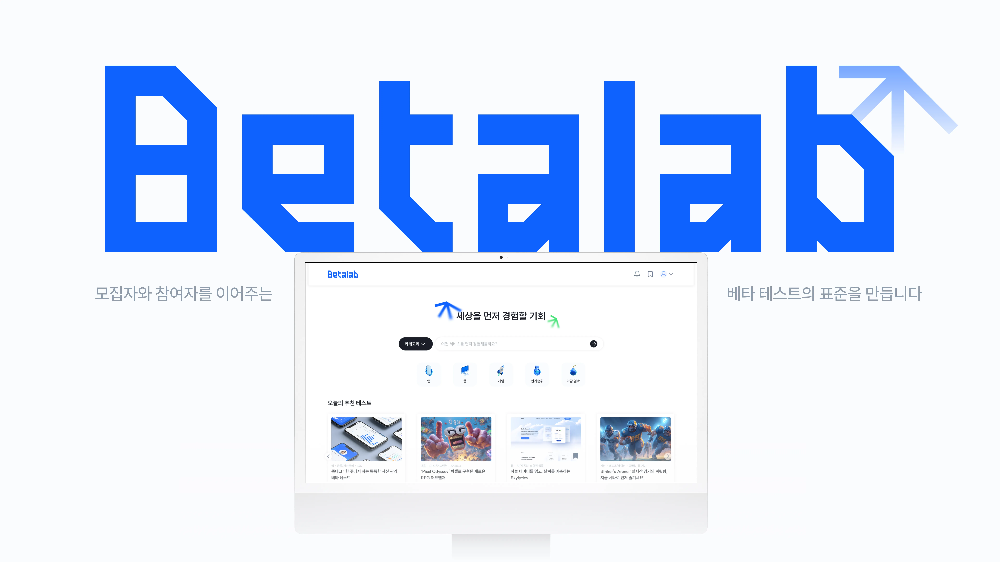
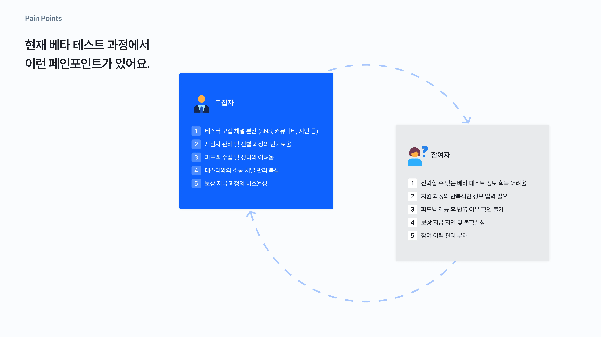
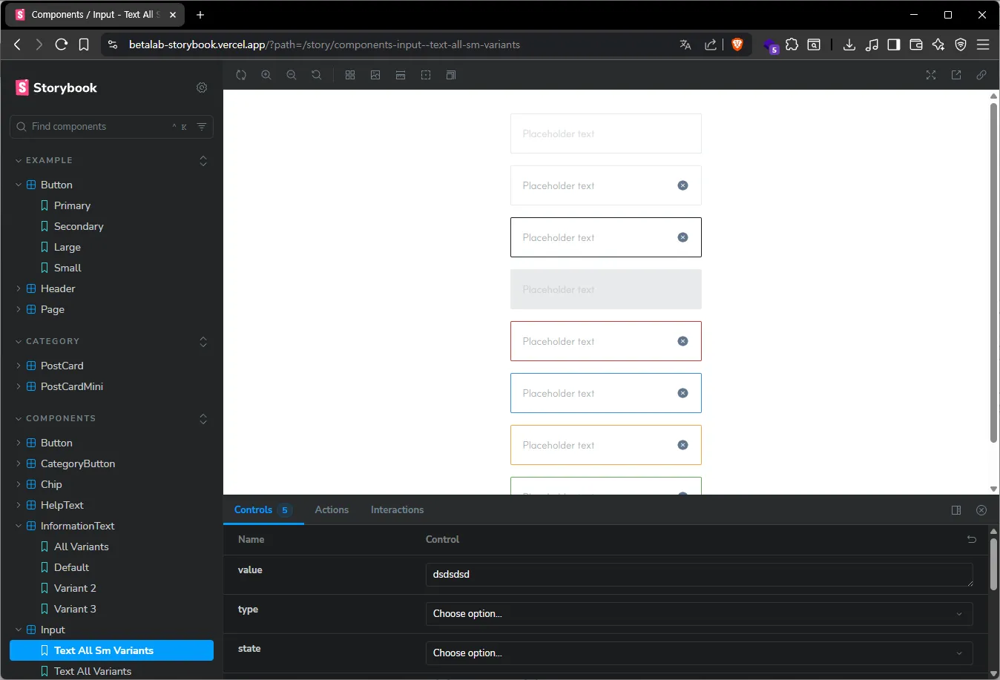
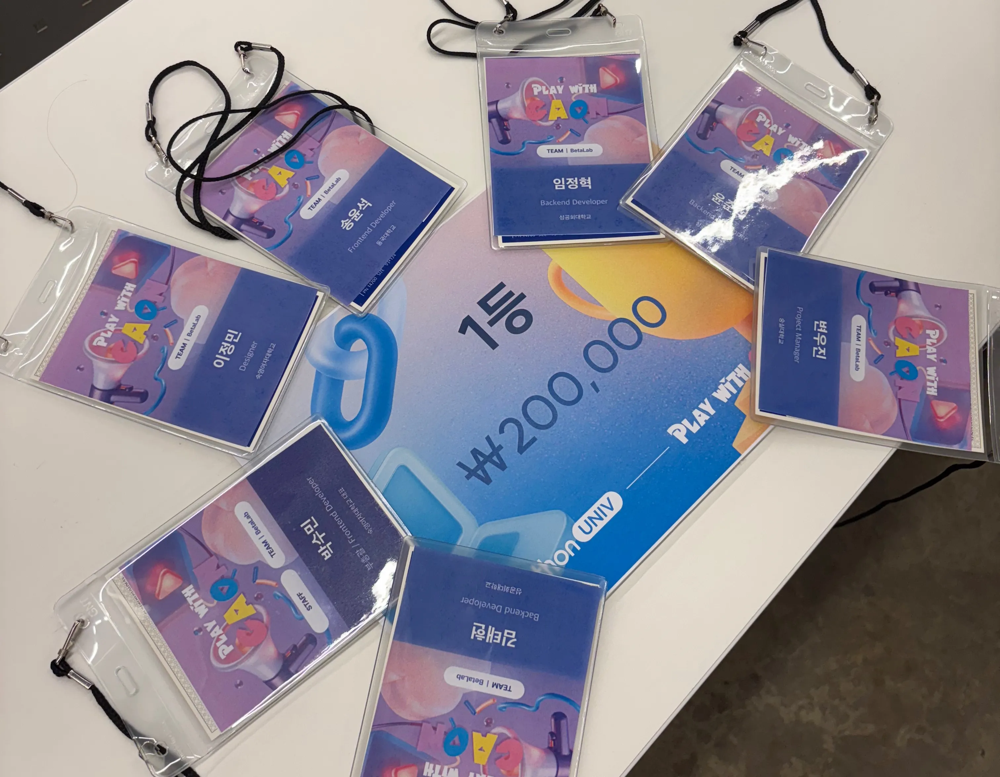

## 연합 프로젝트 NEXUS 시작


이번 기수부터 구름톤 유니브는 지부 단위로 연합 활동을 진행하게 되었습니다.
저는 동국대, 숙명여대, 숭실대, 가톨릭대, 성공회대가 속한 **✨가온 지부✨**에 속해있습니다.

가온지부는 9월에 있을 시즌톤을 대비해 연합 프로젝트 NEXUS로 미르미들에게 프로젝트 경험과 협업 경험을 제공합니다.



이번 연합프로젝트 NEXUS에 기획자 분들이 8개의 기획안을 올려주셨는데, 그중 제가 지원하여 합류한 팀은 **베타랩**입니다.

**베타랩**은 베타테스트의 전 과정을 연결하는 웹 기반 플랫폼으로, 기존의 비효율적인 문제들을 해결하고자 합니다.



- **모집자**는 신청·승인·피드백 관리가 여러 툴에 분산되어 시간과 데이터 관리에 어려움을 겪고,
- **참여자**는 적합한 테스트를 찾기 어렵고 진행 상황 확인도 번거롭습니다.
- 더불어 리워드 지급·리뷰 수집 과정이 표준화되지 않아 불필요한 비용과 노력이 발생합니다.

베타랩은 이러한 문제들을 한 곳에서 해결할 수 있도록 지원하는 플랫폼을 지향합니다.

저는 평소 베타테스트 게임이나 프로그램에 관심이 많았고, 최근 들어 **안드로이드 앱을 출시하려면 거의 필수적으로 베타테스트 유저를 모집해야 하는 번거로움**을 직접 보면서 불편함을 느껴왔습니다.
그래서 이번 베타랩 기획이 굉장히 매력적이고 실효성 있는 아이디어라고 생각되어 더욱 흥미롭게 다가왔습니다.

## 베타렙 기술 스택 선정

6주 동안 진행된 프로젝트는

- **2주차: 프로젝트 세팅 및 준비**
- **2주차: 개발 60% 진행**
- **2주차: 마무리 단계**

이런 식으로 스프린트를 나누어 진행했습니다.

저는 프론트엔드 파트로 참여했기에, 팀원들과 기술 스택을 회의 후 결정했습니다.

다들 리액트 프로젝트 경험이 있었고, 실제 서비스로 출시된다면 **베타랩은 SEO 노출이 중요**하다고 판단하여 `Next.js`를 선택했습니다.

API 통신은 자주 해왔지만 늘 어려운 부분 중 하나였는데, 팀원 모두가 `Tanstack Query`를 다뤄본 경험이 있었고 저 역시 꼭 써보고 싶었던 기술이었기에,
`Axios`로 공통 인스턴스를 만들고, `Tanstack Query`로 서버 상태와 API 훅을 관리하는 구조를 도입했습니다.

또한 `Zod`를 활용해 **런타임에서 백엔드 스키마 검증, 프론트엔드 입력값 검증**을 동시에 처리해 안전한 프론트엔드를 구축할 수 있었습니다.



디자이너분이 직접 디자인 시스템을 제작해주셨기에, 프론트엔드도 자연스럽게 디자인 시스템 구축을 우선시하게 되었고, 컴포넌트를 체계적으로 관리하기 위해 `Storybook`을 떠올렸습니다.
그동안 제대로 사용해볼 기회가 없었는데, 이번 프로젝트에서 처음 도입하면서 개발 과정에서 컴포넌트를 독립적으로 관리하고 문서화할 수 있어 정말 유용하다는 걸 느꼈습니다.

## Next.js 서버 컴포넌트에서 prefetch하기

이번에 `Next.js`를 사용하며 서버 컴포넌트에서 데이터를 prefetch해보고 싶었습니다.

이를 위해서는 Next.js 서버가 사용자의 토큰 정보를 읽어 백엔드 서버로 전달할 수 있어야 했습니다.

### 서버 컴포넌트에서 인증 정보 얻기


백엔드 서버는 JWT를 기반으로 인증을 처리하며, 로그인 시 발급된 토큰을 JSON 값으로 프론트엔드에 내려줍니다.
Next.js는 서버 렌더링 시 사용자의 인증 정보를 알아야 하기 때문에, 토큰을 쿠키에도 저장하도록 했습니다.

문제는 인증이 필요한 API 요청이 많다는 점이었습니다.

- 브라우저 → 백엔드 요청은 일반적인 방식대로 로컬스토리지에 저장된 토큰을 꺼내 `Authorization` 헤더로 전송했습니다.
- 하지만 **Next.js 서버에서 SSR을 수행할 때**는 브라우저의 로컬스토리지에 접근할 수 없기 때문에, 쿠키에 저장된 토큰을 읽어 백엔드로 요청을 보냈습니다.

이렇게 로컬스토리지 + 쿠키 두 가지 방식을 병행한 이유는, 프론트엔드와 백엔드의 URL이 달라 `Cross-site` 쿠키만으로는 처리가 까다로웠기 때문입니다.

정리하면,

- 브라우저는 로컬스토리지 토큰을 사용해 직접 API 요청을 보내고,
- Next.js 서버는 쿠키에서 토큰을 읽어 SSR 시 필요한 데이터를 미리 불러올 수 있었습니다.

이 구조 덕분에 브라우저와 서버 양쪽 모두에서 인증이 필요한 데이터를 안정적으로 가져올 수 있었고, **SSR 환경에서도 빠른 첫 화면**을 제공할 수 있었습니다.

---

이를 위해 Next.js의 **API Route**를 활용했습니다.


1. 브라우저에서 로그인 요청 →
2. Next.js 서버가 API 프록시처럼 백엔드에 전달 →
3. 백엔드 서버가 로그인 성공 시 JWT 발급 →
4. 그 JWT를 브라우저에 내려주면서 동시에 **쿠키에도 저장**

즉, JWT 발급 주체는 백엔드이고, Next.js 서버는 중간에서 전달과 저장 방식을 관리하는 역할을 하도록 설계했습니다.

### `Tanstack Query`를 서버 컴포넌트에서 활용하기

`TanStack Query`를 사용하기로 선택하면서, 서버 컴포넌트에서도 TanStack Query를 활용해 데이터를 미리 가져오는 방법을 시도해봤습니다.

핵심 아이디어는 간단합니다. 서버에서 데이터를 미리 받아서 쿼리 캐시에 저장하고, 그 상태를 클라이언트로 넘겨주면, 클라이언트는 바로 화면에 데이터를 표시할 수 있습니다.

이를 위해선

**1. 서버에서 QueryClient 생성**
서버 컴포넌트에서 `QueryClient`를 만들고, 필요한 데이터를 prefetch 합니다.

**2. Prefetch한 데이터 캐시에 저장**
`prefetchQuery`를 사용하면, 서버가 데이터를 가져오면서 쿼리 키에 딱 맞게 저장됩니다.

**3. Dehydrate로 상태 직렬화**
`dehydrate(queryClient)`를 사용해서 현재 쿼리 캐시 상태를 추출하고, 이걸 클라이언트로 전달합니다.

**4. 클라이언트에서 Hydrate**
클라이언트에서는 `Hydrate`를 이용해 서버에서 내려준 상태를 복원합니다.
이후 같은 쿼리 키로 `useQuery`를 호출하면, 서버에서 이미 가져온 데이터를 재사용하기 때문에 추가 요청 없이 바로 화면 렌더링이 가능합니다.

```tsx
// 서버 컴포넌트
await queryClient.prefetchQuery(['user'], fetchUserData);
const dehydratedState = dehydrate(queryClient);

// 클라이언트 컴포넌트
<Hydrate state={dehydratedState}>
  <UserProfile />
</Hydrate>;
```

이를 통해 클라이언트에서 불필요한 API 요청 감소하고, 클라이언트에서 바로 데이터를 보여줘서 사용자 경험을 향상 시킬 수 있었습니다.

간단하지만, 서버에서 미리 데이터를 가져와 클라이언트와 공유하는 흐름 하나로 SSR과 TanStack Query를 깔끔하게 연결할 수 있습니다.

## Axios 공통 인스턴스 사용

클라이언트와 서버 요청시 각각 사용할 공통 **Axios 인스턴스**를 만들어, API 요청을 보다 유연하게 관리했습니다.

- 매 요청마다 `BASE_URL`을 반복 설정할 필요가 없고,
- 요청 실패 시 재시도 큐를 활용해 자동으로 재요청이 가능하며,
- 토큰이 만료되면 자동으로 재발급 후 동일 요청을 다시 시도하도록 구현했습니다.

덕분에 팀원들은 API 연동 시 인증이나 에러 처리 등 복잡한 부분을 신경 쓰지 않고, **쿼리 훅이나 UI 로직에 집중**할 수 있었습니다.

```ts
// 요청 인터셉터: 토큰 자동 포함
instance.interceptors.request.use(config => {
  const accessToken = localStorage.getItem('accessToken');
  if (accessToken) {
    config.headers['Authorization'] = `Bearer ${accessToken}`;
  }
  return config;
});
```

- 요청 시 자동으로 로컬스토리지의 토큰을 헤더에 포함시킵니다.

---

```ts
// 401 에러 처리 및 재시도 큐
let isRefreshing = false;
let failedQueue: any[] = [];

function processQueue(error: any, token: string | null = null) {
  failedQueue.forEach(prom => {
    if (token) prom.resolve(token);
    else prom.reject(error);
  });
  failedQueue = [];
}
```

- **재시도 큐**를 만들어 동시에 여러 요청이 401을 받을 경우, 토큰 재발급이 끝날 때까지 대기시키고 순서대로 재시도합니다.

---

```ts
// 응답 인터셉터: 401 → 토큰 재발급 후 재시도
if (error.response?.status === 401 && !originalRequest._retry) {
  originalRequest._retry = true;
  const res = await axios.post('/api/auth/reissue', null, { withCredentials: true });
  const newAccessToken = res.data.message;
  localStorage.setItem('accessToken', newAccessToken);

  processQueue(null, newAccessToken);
  originalRequest.headers['Authorization'] = `Bearer ${newAccessToken}`;
  return instance(originalRequest);
}
```

- 서버가 401을 반환하면, 토큰을 재발급 받고 원래 요청을 다시 실행합니다.
- 동시에 대기 중인 요청은 재시도 큐를 통해 순서대로 실행됩니다.

> 전체 코드는 [GitHub 레포](https://github.com/PROJECT-NEXUS-JS/betalab-frontend/tree/main/apis)에서 확인할 수 있습니다.

## 🏆프로젝트 후기 & 수상

6주 동안 진행된 NEXUS 연합 프로젝트는 단순한 개발 경험을 넘어, 나 자신이 한 단계 성장했다는 느낌을 받을 수 있는 시간이었습니다.

매주 스프린트를 나눠 진행하며 계획을 세우고 일정에 맞춰 진행하는 능력도 늘었고, 개인적으로는 Next.js의 다양한 기능을 직접 적용해보며 어렵다고만 느꼈던 부분들을 몸으로 익히는 경험을 할 수 있었습니다.
TanStack Query를 사용하며 쿼리키와 캐싱, 뮤테이션 개념을 이해하고, API와 서버 상태를 다루는 방법도 한층 깊게 배울 수 있었습니다.



그리고 결과적으로 **팀이 1등을 차지했습니다!**
전체 6주, 본격 개발은 4주가량 팀원 모두 열심히 하고, 마지막날 새벽까지 QA를 하며 마무리한 보람이 있었습니다!
(상금은 8명이서 20만 원이지만, 성장과 배움이라는 값진 경험이 훨씬 컸습니다! 😆)

### 이번 프로젝트에서 느낀 점

- 적절한 기술 선택과 협업으로 짧은 시간에도 결과를 만들어낼 수 있다는 자신감을 얻었습니다.
- 서버와 클라이언트 로직을 직접 고민하며 구조를 이해하고 설계할 수 있는 경험을 할 수 있었습니다.
- 팀원과 소통하며 각자의 역할을 조율하고 협력하는 과정에서 배우는 점이 많았습니다.

이번 프로젝트 덕분에 **베타랩을 처음부터 끝까지 경험하면서 내가 성장했다는 체감**을 가장 크게 느낀 경험이었고, 다음 프로젝트에서도 이 경험을 바탕으로 더 발전할 수 있다는 자신감을 얻었습니다.

비록 9월의 시즌톤에는 참가하지 못하지만, 앞으로 **프론트엔드 개발이나 다른 개발 분야에서도 이번 프로젝트에서 쌓은 지식과 경험, 자신감**을 바탕으로 한층 성장할 수 있을 것 같습니다.
