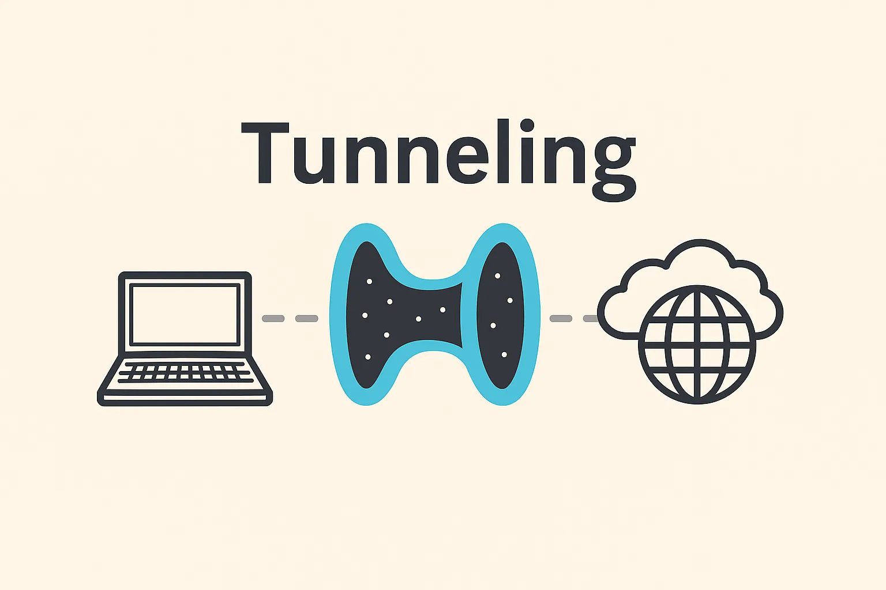
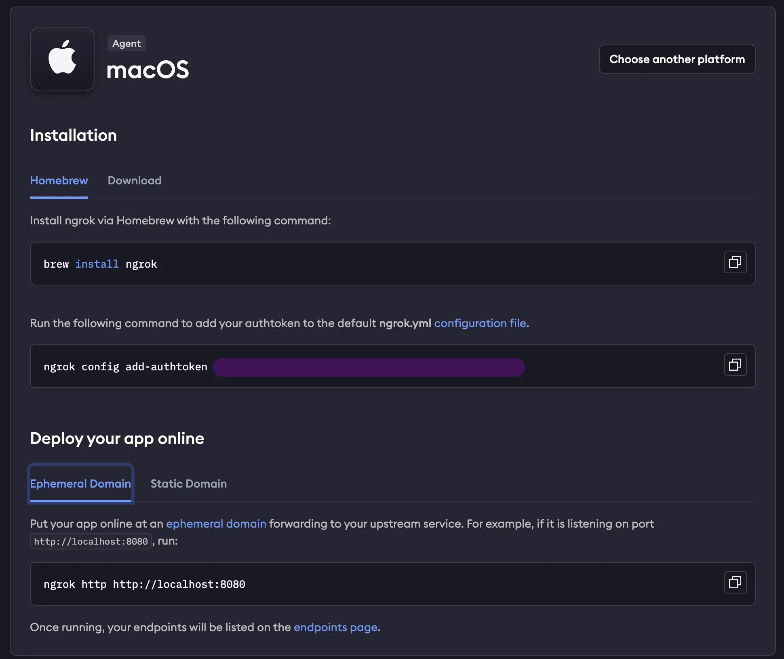
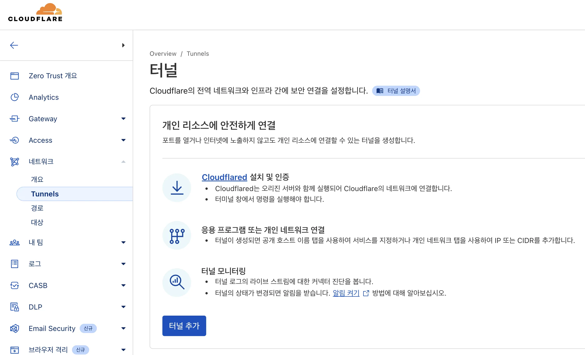

대학교 실습강의, 무박 해커톤 등에서 서버를 만들어야 할 일이 많습니다.

하지만 공유기 설정을 바꿀 수 없는 등 환경이 마땅치 않거나, 포트포워딩을 하고싶지/해보지 않아서 어려움이 있어도, 포트포워딩 없이 서버를 외부로 공개하는 방법이 있습니다.

**답은 '터널링 툴'을 사용하는 것입니다.** `ngrok`, `Cloudflare Tunnel`, `localtunnel` 같은 **터널링 툴**을 사용하면 간단하게 해결할 수 있습니다.


## 터널링?



터널링(Tunneling)은 로컬 서버를 인터넷에 안전하게 노출시켜주는 기술입니다.
이 방식은 중간 서버(릴레이 서버)를 거쳐 외부 요청을 로컬 서버로 전달하므로, 포트포워딩 없이도 외부에서 접근이 가능합니다.


### 대표적인 터널링 툴 3종 비교

| 항목         | ngrok         | Cloudflare Tunnel | localtunnel |
| ---------- | ------------- | ----------------- | ----------- |
| 세팅 난이도     | 쉬운 편          | 중간                | 쉬운 편        |
| 무료 요금제     | 있음 (제한적)      | 완전 무료             | 완전 무료       |
| 사용자 지정 도메인 | 무료 1개, 랜덤 생성 | 가능                | 가능          |
| 로그인 필요 여부  | 필요            | 필요                | 불필요         |
| 성능 / 안전성   | 매우 우수         | 매우 우수             | 다소 불안정      |
| 오픈소스 여부    | 아니오           | 아니오               | 예           |
| HTTPS 지원   | 기본 제공         | 기본 제공             | 기본 제공       |
| 권장 용도      | 빠른 테스트, 데모 공유 | 실서비스 연동, 프록시 목적  | 간단한 테스트     |


## ngrok

`ngrok`은 상용 터널링 툴로 계정당 **하나의 무료 https 정적 도메인을 제공**합니다. 세팅이 정말 쉽고, 연결이 안정적입니다.

다만, 무료 도메인은 랜덤으로 생성되고 길이가 깁니다. (Ex. `easy-regular-dane.ngrok-free.app`)


### 세팅 방법

로그인 후 [ngrok 대시보드](https://dashboard.ngrok.com/get-started/setup/)로 이동합니다.



```shell
# 맥 OS
brew install ngrok
```
```shell
# 윈도우
choco install ngrok
```
```shell
# Linux
curl -sSL https://ngrok-agent.s3.amazonaws.com/ngrok.asc \
  | sudo tee /etc/apt/trusted.gpg.d/ngrok.asc >/dev/null \
  && echo "deb https://ngrok-agent.s3.amazonaws.com buster main" \
  | sudo tee /etc/apt/sources.list.d/ngrok.list \
  && sudo apt update \
  && sudo apt install ngrok
```

설치 후 토큰을 설정하고, 로컬 호스트 포트와 `ngrok`을 연결시켜주면 됩니다.

```shell
ngrok http http://localhost:8080
ngrok http --url=easy-regular-dane.ngrok-free.app 8080
```

첫 번째 명령어로 만들게 되면 매 실행마다 바뀌는 임시 도메인을 부여받습니다. 두 번째 명령어처럼 `--url` flag로 자신의 정적 도메인을 연결할 수 있습니다. 

`ngrok` 대시보드의 `Deploy your app online`에서 `Static Domain` 버튼을 눌러 확인할 수도 있고, 좌측 메뉴의 `Universal Gateway > Domains`에서도 확인 가능합니다.


## Cloudflare Tunnel

클라우드 플레어는 전세계를 대상으로 DDoS 방어, CDN, DNS 등의 서비스를 제공하는 기업입니다. 이들이 제공하는 서비스 중 `Zero Trust`에서 터널링을 제공합니다.

`Zero Trust`는 위협이 네트워크 내부와 외부 모두에 존재한다고 가정하는 IT 보안 모델로, `Zero Trust > 네트워크 > Tunnels` 서비스를 활용하면 전역 네트워크와 인프라 간에 보안 연결을 설정할 수 있습니다.





## localtunnel

> https://github.com/localtunnel/localtunnel

