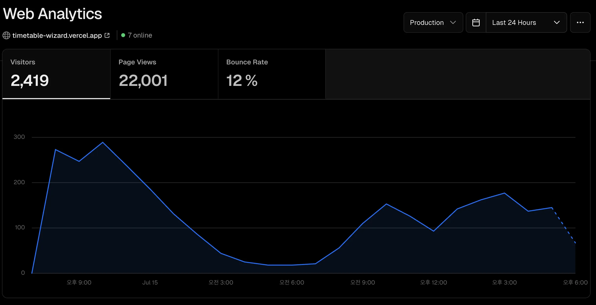
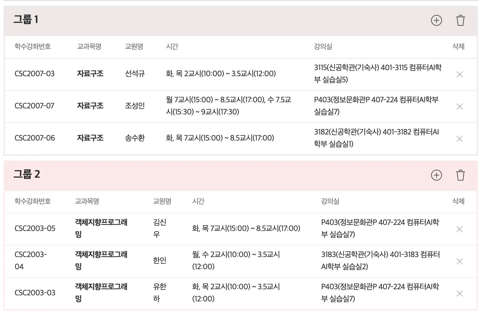
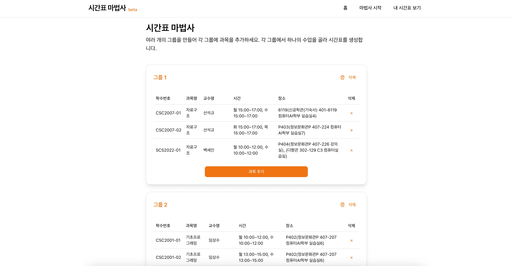
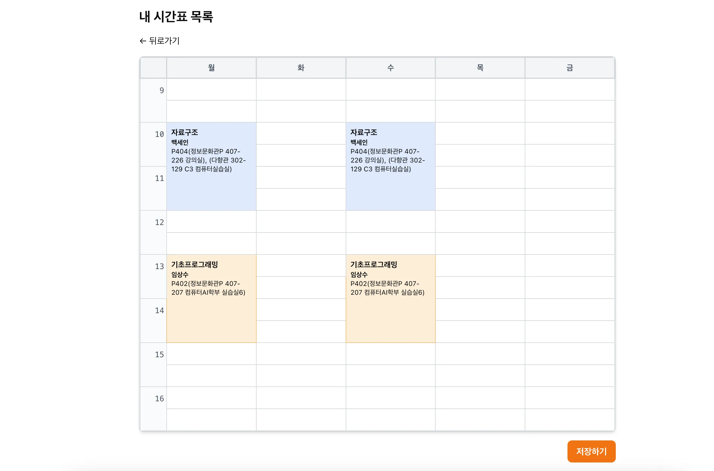
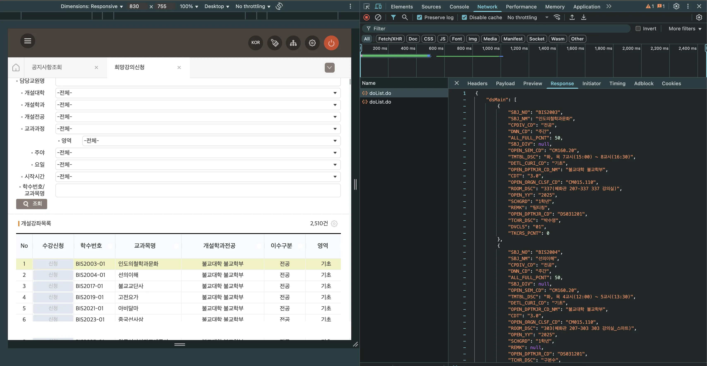

2학기 수강 신청을 앞두고, 하루 동안 만든 시간표 마법사 (시간표 자동 조합기)가, **Vercel 트래픽 기준 누적 2500명 접속**을 기록했습니다.

가벼운 마음에 시작한 토이 프로젝트였지만 예상보다 반응이 좋아, 이번 기회에 제작 후기와 개발 중 겪은 이슈, 그리고 개선하며 느낀 인사이트를 정리해보려 합니다.

📌 먼저 서비스부터 보고 싶다면?

> ⚠️ 현재는 동국대학교의 시간표 데이터를 기반으로 하고 있으며, 다른 학교의 시간표는 지원하지 않습니다.  
> 추후 데이터 포맷이 유사하다면 확장도 가능하겠지만, 우선은 제 학교 중심으로 빠르게 만들어보는 데 집중했습니다.

- 🚀 서비스 바로가기: https://timetable-wizard.vercel.app
- 🛠 GitHub 저장소: https://github.com/karpitony/timetable-wizard

## 기획 배경



대학생들이 자주 사용하는 앱인 **에브리타임**에는 "시간표 마법사"라는 기능이 존재합니다.
사용자가 수업을 그룹별로 추가하고, 각 그룹에서 하나씩 선택해 가능한 시간표 조합을 만들어주는 기능이죠.

하지만 에브리타임의 시간표 데이터는 **즉시 업데이트되지 않으며**, 많은 대학생이 업데이트 전까지 기다리며 답답함을 느끼는 상황이었습니다.
저 역시 희망 강의 신청 전에 빠르게 시간표를 구성해보고 싶었습니다.

그래서 **"이건 지금 만들면 사람들이 분명히 쓸거다"** 싶었고, 로그인 없이 누구나 빠르게 사용 가능한 **웹 기반 시간표 마법사**를 만들게 되었습니다.

- 목표: 그룹별 수업 조합 → 가능한 시간표들 자동 생성
- 핵심 기능:
  - 로그인 없이 즉시 사용
  - 시각적인 시간표 UI
  - 간단한 로컬 저장 기능

|            그룹 생성 화면            |           결과 시간표 예시           |
| :----------------------------------: | :----------------------------------: |
|  |  |

## 기술 스택 및 설계 방향

에브리타임 측의 시간표 업데이트보다 빠르게 출시하려면 개발 속도와 익숙한 도구가 중요했습니다.

- `Next.js`: `React` 기반으로 작업해왔고, 필요하다면 서버 사이드 렌더링이나 API 구축까지 확장할 수 있어 선택했습니다.
- `Vercel`: `Next.js`와 궁합이 좋고, 초기 세팅이 필요 없으며, 배포 속도가 빠르기 때문에 채택했습니다.
- `Tailwind CSS`: 빠르게 UI를 구성하고 수정할 수 있어, 빠른 프로토타이핑에 적합했기에 채택했습니다.
- `shadcn/ui`: Tailwind 기반의 컴포넌트 라이브러리로, 필요한 컴포넌트를 빠르게 가져다 쓸 수 있고, LLM도 이미 학습하였기에 생산성이 높았습니다.

전체적으로는 **"빠르게 만들고 바로 써볼 수 있는 것"** 을 최우선으로 고려했습니다.

## 시간표 데이터 구하기

구현 이야기에 앞서, 시간표 데이터를 어떻게 확보했는지 먼저 공유해보려 합니다.

처음에는 시간표를 수작업으로 정리하거나 크롤링을 해야 하나 고민했지만,
**다행히도 학교 수강편람 시스템(희망 강의 신청 페이지)** 에서 JSON 형식의 API로 전체 시간표 데이터를 내려주고 있었습니다.



브라우저의 개발자 도구로 네트워크 탭을 살펴보니 요청 URL과 응답 구조가 바로 확인되었고,
로그인한 상태라면, 별도의 학과나 단과대 조건 없이 ‘조회’ 버튼만 클릭해도 전체 시간표 데이터를 포함한 JSON 응답을 받을 수 있었습니다.

덕분에 복잡한 크롤링 없이, 전체 시간표 데이터를 한 번에 확보하고 저장할 수 있었고,
이를 기반으로 시간표 마법사에서 사용할 수 있도록 정제 및 가공하는 작업을 진행할 수 있었습니다.

## 구현 과정

### 1. 시간표 데이터 파싱 & 불러오기

보통의 시간표 제작 프로젝트들은 시간표를 파싱 후 DB에 저장할 것입니다.
하지만 당장은 DB와 백엔드를 구축할 여유도 없었고, 별도로 서버가 필요하지 않아 보였습니다.

그래서 Raw 데이터를 시간표 마법사에서 다루기 쉽게 **전처리한 뒤**, 약 5만 줄 분량의 1MB JSON 파일로 저장해 **프론트엔드에서 직접 사용하는 방식**을 선택했습니다.

학교에서 제공하는 데이터는 JSON 형태로 제공되지만, 제일 중요한 수업 시간은 문자열로 되어있었습니다.

```json
{
    "SBJ_NO": "CSC2007",
    "SBJ_NM": "자료구조",
    "CPDIV_CD": "전공",
    ...
    "TMTBL_DSC": "화, 목 7교시(15:00) ~ 8.5교시(17:00)",
    ...
},
```

정규표현식을 사용해서 시간을 추출하는 파서를 만들었습니다.

```typescript
function parseSchedule(timetable: string): Schedule[] {
  const schedules: Schedule[] = [];
  const dayMatches = timetable.match(/[월화수목금토]/g);
  const timeRegex =
    /(\d+(?:\.\d+)?)교시\((\d{1,2}:\d{2})\)\s*~\s*(\d+(?:\.\d+)?)교시\((\d{1,2}:\d{2})\)/;
  const timeMatch = timetable.match(timeRegex);

  if (!timeMatch) return schedules;

  const [, periodStart, startTime, periodEnd, endTime] = timeMatch;

  dayMatches.forEach(day => {
    const dayOfWeek = dayMap[day];
    if (!dayOfWeek) return;

    schedules.push({
      day: dayOfWeek,
      startMinutes: toMinutes(startTime),
      endMinutes: toMinutes(endTime),
      periodStart,
      periodEnd,
    });
  });

  return schedules;
}
```

매번 클라이언트에서 파싱하는 것은 비효율적이라, **빌드 시점에 전처리된 JSON 파일을 생성**하는 스크립트를 만들었습니다.

강의 검색 및 그룹 추가 기능을 위해 클라이언트에서 JSON을 불러오는 훅도 작성했습니다.
`Next.js`에서 `public/` 디렉토리에 있는 정적 파일은 요청 시에만 전달되므로, 이 파일에 쉽게 접근하기 위한 `useCourses()` 훅을 작성했습니다.

```typescript
import { useEffect, useState } from 'react';
import { Course } from '@/types/data';

export function useCourses() {
  const [courses, setCourses] = useState<Course[]>([]);

  useEffect(() => {
    fetch('/parsedData.json')
      .then(res => res.json())
      .then(data => setCourses(data));
  }, []);

  return courses;
}
```

### 2. 데이터 저장하기 - `IndexedDB`

사용자 계정 없이도 시간표 저장 기능을 제공하기 위해 `IndexedDB`를 선택했습니다.
로컬스토리지는 구조화된 데이터 저장에 한계가 있고, 향후 확장성도 고려해 `IndexedDB`를 사용했습니다.

Django 등 서버 공부를 해보며 MVC 구조를 학습해봤기에 이를 적용해보고 싶었습니다.
그래서, IndexedDB 접근 로직을 `lib/indexed-db-model.ts`에 모듈화하여 정리하고, 이를 불러와 사용하도록 했습니다.

### 3. 시간표 조합 알고리즘

핵심 로직은 다음과 같은 세 가지 단계를 따릅니다.

1. **모든 조합 생성**: 각 그룹에서 하나의 수업을 선택
2. **시간 충돌 검사**: `startMinutes`, `endMinutes` 기반
3. **점수화 및 정렬**: 공강, 연강 여부, 수업 시작/종료 시간 기준 가중치 부여

```ts
export function generateTimetables(groups: GroupData[]) {
  const groupCourses = groups.map(group => group.data);
  const combinations = generateCombinations<Course>(groupCourses);

  const valid = combinations.filter(combo => !hasAnyConflict(combo.map(c => c.timeSlots)));
  const scored = valid.map(combo => ({
    timetable: combo,
    score: scoreTimetable(combo.map(course => course.timeSlots)),
  }));

  return scored.sort((a, b) => b.score - a.score);
}
```

`generateCombinations()` 함수로 모든 조합을 생성하고, `.filter`와 `hasAnyConfilct()` 강의가 충돌하는 시간표를 제거합니다.
그후 점수를 저장하는 객체로 변환하고, 점수를 기준으로 정렬했습니다.

각 기능별로 코드를 살펴보면,

1. `각 그룹 → 하나씩 선택 → 조합 생성` (브루트포스 방식)

```ts
export function generateCombinations<T>(groups: T[][]): T[][] {
  if (groups.length === 0) return [];

  return groups.reduce<T[][]>(
    (acc, group) => {
      const newCombos: T[][] = [];
      for (const combo of acc) {
        for (const item of group) {
          newCombos.push([...combo, item]);
        }
      }
      return newCombos;
    },
    [[]], // 초기값: 빈 조합 하나
  );
}
```

2. `조합별 충돌 검사` (startMinutes, endMinutes 기준)

```ts
import { Schedule } from '@/types/data';

export function hasConflict(a: Schedule[], b: Schedule[]): boolean {
  for (const slotA of a) {
    for (const slotB of b) {
      if (slotA.day !== slotB.day) continue;
      if (slotA.endMinutes > slotB.startMinutes && slotB.endMinutes > slotA.startMinutes) {
        return true; // 겹침
      }
    }
  }
  return false;
}

export function hasAnyConflict(courses: Schedule[][]): boolean {
  for (let i = 0; i < courses.length; i++) {
    for (let j = i + 1; j < courses.length; j++) {
      if (hasConflict(courses[i], courses[j])) {
        return true;
      }
    }
  }
  return false;
}
```

초기 설계 의도와 달리 호출 구조가 달라져, 급하게 래핑 함수(`hasAnyConflict`)를 작성하게 되었습니다.
이 과정에서 복잡도가 `O(n^4)`까지 증가한 것이 아쉽긴 했지만, 체감 성능이 크게 떨어지지 않아 리팩토링은 추후 과제로 남겨두었습니다.

3. `점수화 및 정렬`

- 공강이 많을수록 +점
- 연강이 적을수록 +점
- 늦게 시작하고 일찍 끝날수록 +점

해당 로직은 코드는 길지만, 크게 중요한 내용은 아니라고 생각하여 아래 GitHub 링크를 첨부합니다.

👉 [점수화 함수 보기](https://github.com/karpitony/timetable-wizard/blob/main/lib/score-timetable.ts)

마지막으로, 시간표 자동 생성 함수를 클라이언트에서 더 편하게 호출할 수 있도록 커스텀 훅을 따로 구성했습니다.

```ts
import { useState } from 'react';
import { GroupData } from '@/types/group';
import { Course } from '@/types/data';
import { generateTimetables } from '@/lib/generate-timetables';

interface TimetableResult {
  timetable: Course[];
  score: number;
}

export function useTimetables() {
  const [isLoading, setIsLoading] = useState(false);
  const [timetables, setTimetables] = useState<TimetableResult[]>([]);
  const [error, setError] = useState<string | null>(null);

  const generate = async (groups: GroupData[]) => {
    setIsLoading(true);
    setError(null);

    try {
      const timeTables = generateTimetables(groups);
      setTimetables(timeTables);
    } catch (e: unknown) {
      if (e instanceof Error) {
        setError(e.message);
      } else {
        setError('알 수 없는 오류가 발생했습니다.');
      }
    } finally {
      setIsLoading(false);
    }
  };

  return {
    generate,
    timetables,
    isLoading,
    error,
  };
}
```

## ✨ 만들고 나서 얻은 인사이트

이번 프로젝트를 통해 가장 크게 느낀 건,
**"틈새를 잘 노리면 작은 프로젝트도 충분히 반응을 얻을 수 있다"** 는 점이었습니다.

- 사용자의 페인포인트(불편한 점)를 빠르게 포착하고
- 로그인, 계정, 서버 없이도 바로 쓸 수 있는 구조로 접근성을 높였으며
- 시기를 놓치지 않고 빠르게 출시한 것이 좋은 반응으로 이어졌습니다.

특히 주변 지인들 사이에서

> “에브리타임 아직 업데이트 안 됐는데 이거 쓰면 되겠다, 정말 편하다”

는 피드백을 자주 들었고, 버셀 기준 2,500명 이상이 직접 접속해 사용했다는 점은 개인적으로도 인상 깊었습니다.

이 글에서 소개한 시간표 마법사는 아래에서 직접 사용해보실 수 있습니다 😄

> 현재는 동국대학교의 2학기 시간표만 포함되어 있습니다.

- 🧪 **웹 서비스**: https://timetable-wizard.vercel.app
- 💻 **코드 보기 (GitHub)**: https://github.com/karpitony/timetable-wizard

## 다음 글 예고

이번 글에서는 기획과 구현, 전체 흐름을 중심으로 소개했습니다.
하지만 실제 개발 과정에서는 다음과 같은 문제들이 있었습니다.

- 교시 문자열 파싱 과정에서 예외 케이스가 발생
- 색상 겹침, 모바일 버벅임 등

여러 가지 디버깅 이슈가 있었습니다.

이러한 트러블슈팅 경험과
실제 사용자 피드백 기반의 개선 과정은 다음 글에서 따로 소개할 예정입니다.
읽어주셔서 감사합니다 🙌
