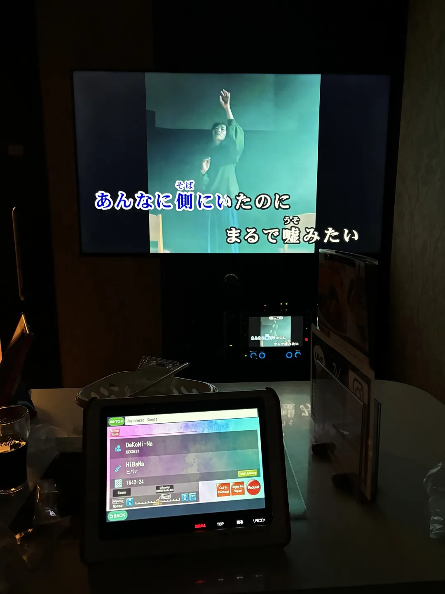
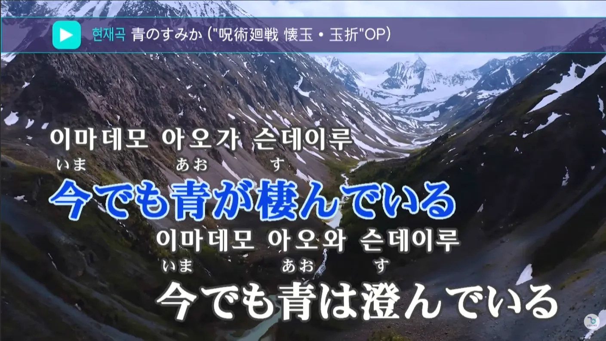
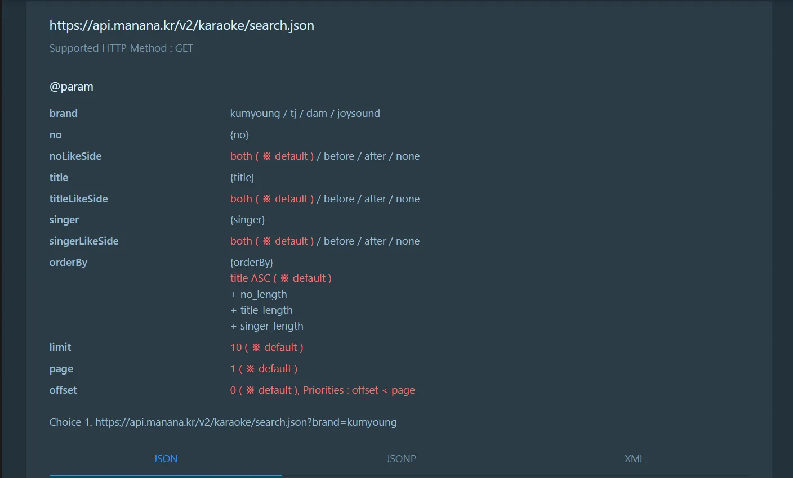
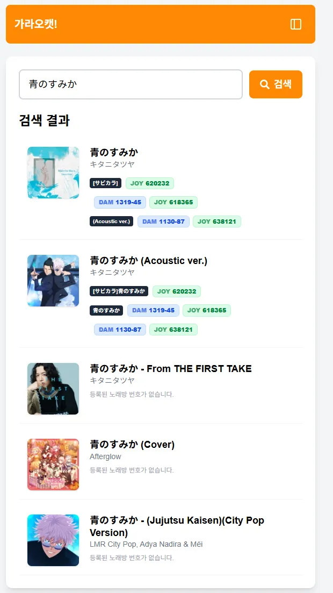
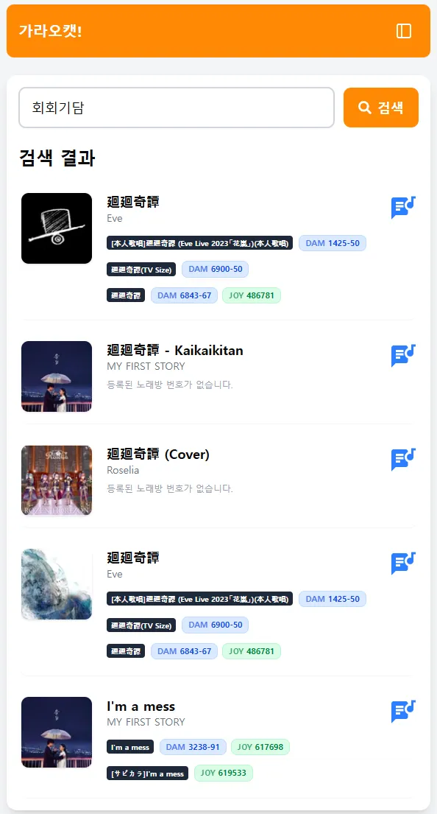
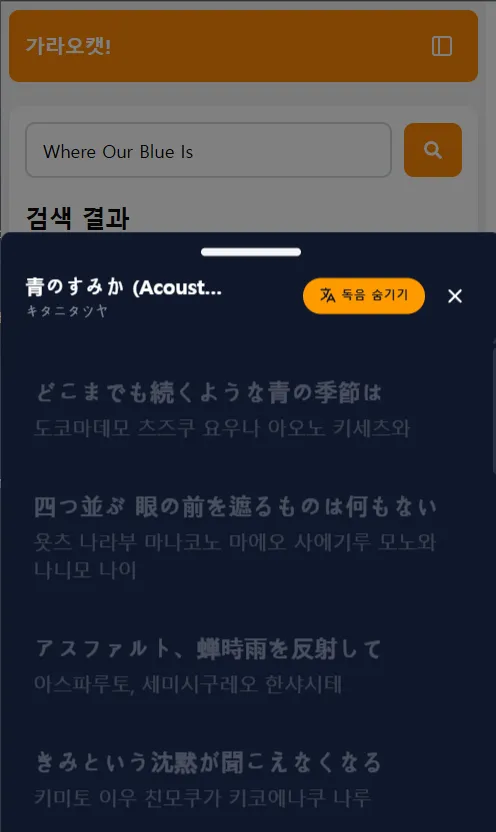
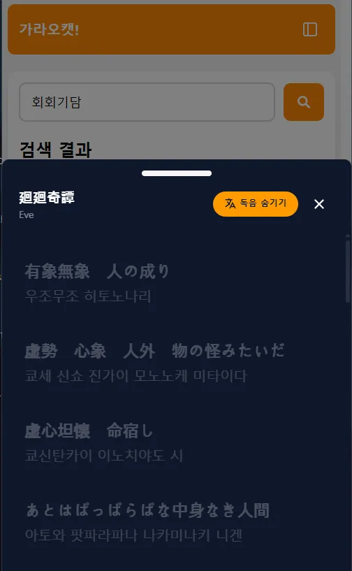
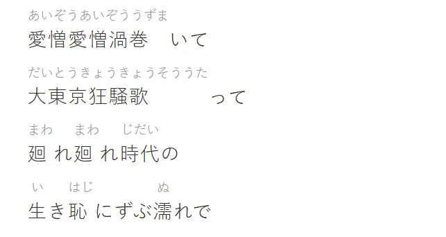

<br>

혹시 일본 여행 중 가라오케에 가본 적 있으신가요?

한국 노래방에는 없는 최신 J-POP이나 좋아하던 애니메이션 OST를 직접 불러볼 수 있다는 생각에, 설레는 마음으로 마이크를 잡게 됩니다.

저 역시 그랬습니다.

하지만 즐거움도 잠시, 각오했던 불편함을 겪게 됐습니다.

일본어를 거의 모르는 상태에서 일본 가라오케를 이용하는 일은 생각보다 쉽지 않았습니다.

노래 자체는 즐거웠지만, 사용자 경험 측면에서는 분명 아쉬움이 있었습니다. 그 경험이 계기가 되어, 한국에 돌아오자마자 노트북을 열게 되었습니다.

일본어를 공부하는 대신(?) 문제를 코드로 해결해보기로 한 개발자의 이야기입니다.

## 문제 상황

일본 여행 중, 한국 노래방에는 등록되지 않은 일본 곡을 불러보고 싶어 가라오케를 찾았습니다.

그 과정에서 두 가지 어려움을 겪었습니다.

### 1. 곡을 검색하기 어렵다

한국 노래방에서 일본곡을 부를때 `푸르름이 사는 곳 + 노래방 번호`와 같이 구글 검색 한번으로 쉽게 곡을 찾을 수 있습니다.

하지만 일본 가라오케는 JOYSOUND나 DAM 같은 브랜드 중심으로 운영되며, 해당 번호 정보는 한국에서 찾기 쉽지 않습니다.

일본어를 잘 모르는 저는 다음과 같은 과정을 거쳐야 했습니다.

```txt
한국어로 곡 검색 (푸르름이 사는 곳)
-> 일본어 원어 찾기 및 복사 (青のすみか)
-> JOYSOUND/DAM 홈페이지에서 다시 검색
```

단순히 한 곡을 찾기 위해 여러 단계를 거쳐야 했고, 여행 중에 하기엔 번거로운 작업이었습니다.

### 2. 곡을 부르기 어렵다



한국 노래방은 일본 곡을 재생할 경우,
일본어 가사 아래에 한국어 발음을 함께 제공합니다.

이 환경에 익숙해져 있던 저는 일본 가라오케에서 발음 표기가 없다는 사실을 크게 체감했습니다.

가사를 완벽히 외우지 못한 상태였기에,
휴대폰으로 가사를 따로 보며 화면의 진행 바에 맞춰 박자를 맞추는 방식으로 노래를 불러야 했습니다.

노래는 즐거웠지만, 사용 과정은 불편했습니다.
이 경험은 “다음에도 또 가고 싶다”는 마음을 조금은 망설이게 만들었습니다.

### 해결책을 찾아보기

한국으로 귀국 후, 비슷한 경험을 한 사람들이 있는지 찾아봤습니다.

대부분의 팁들은

- 한국에서 미리 곡 번호를 정리해가기
- 가사를 외워가기

와 같은 방식이었습니다.

물론 현실적인 방법이지만, 매번 준비가 필요한 구조라는 점에서 아쉬움이 남았습니다.

평소에 스스로의 불편함을 해결하는 것을 좋아했고,
같은 어려움을 겪을 사람들에게도 도움이 될 수 있겠다는 생각이 들었습니다.

그래서 직접 만들어보기로 했습니다.

## 직접 만들기로 결심하다: 아키텍처 설계

웹 프론트엔드를 주력으로 공부해왔기 때문에, 우선 익숙한 `Next.js`로 MVP를 빠르게 만들어보고, 이후 `Nest.js + React Native`로 확장하는 방향을 구상했습니다.

해결해야할 문제는 명확했습니다.

1. **곡 검색 단순화**
   한국어로 검색해서 JOYSOUND, DAM 번호를 얻는다.

2. **가사 및 한국어 발음 제공**
   가사와 발음을 함께 제공해, 앱 하나로 노래 준비를 끝낼 수 있도록 한다.

### 처음 접근: 직접 모든 데이터를 관리하는 방법

처음에는 호기롭게 **모든 데이터를 내가 다 들고 있겠다!** 라는 생각으로 DB 설계를 시작했습니다.

그래서 한국어 제목, 원어 제목, 그리고 노래방 기기별 번호를 매핑하는 구조를 설계했습니다.

```ts
interface SongNameTable {
  id: int;
  songTitleKorean: string;
  songTitleOriginal: string;
  songId: int; // foreign key
}
interface SongDataTable {
  id: int;
  title: string;
  singer: string;
  numbers: {
    brand: 'JOYSOUND' | 'DAM' | 'TJ' | 'KY';
    no: string;
  }[];
}
```

구조 자체는 단순했습니다.
문제는 데이터를 어떻게 채우느냐였습니다.

#### 1. **언어의 장벽**

곡마다

- 한국어 제목
- 일본어 원제목
- 가수명
- 노래방 번호

를 정확히 매핑한 대규모 데이터셋이 필요했습니다.

일부 곡들에 대한 엑셀들을 찾을 수 있었지만, 예외 케이스가 너무 많았고 데이터 정합성을 보장하기 어려웠습니다.

이 방향은 유지보수 비용이 지나치게 클 것 같다고 판단 했습니다.

#### 2. **크롤링의 한계**

JOYSOUND나 DAM 사이트를 직접 크롤링하는 방법도 고민했습니다.

하지만,

- 구현 및 유지 비용이 높고
- 서비스 정책 이슈 가능성이 있으며
- 트래픽 부하를 줄 수 있는 구조

라는 점에서 장기적으로 적절하지 않다고 느꼈습니다.

### 노래방 번호 API의 발견



그 과정에서 `manana.kr`의 API를 발견했습니다.
이 API는 `TJ`, `금영`, `JOYSOUND`, `DAM` 번호를 함께 제공하고 있었습니다.

노래방 번호를 직접 수집하고 관리하지 않아도 된다는 점에서 큰 매력을 느꼈습니다.
하지만 여전히 문제가 남아 있었습니다.

이 API에 검색어를 보내려면 정확한 원어 제목이나 가수명이 필요했습니다.

<br>

예를 들어,

> "푸르름이 사는 곳"

이라고 검색하면 원하는 결과를 얻을 수 없었습니다.

결국 `한국어 검색어 → 원어 메타데이터`를 해결해야 했습니다.

### 유튜브와 스포티파이에서 찾은 실마리

아이디어가 막혀 잠시 손을 놓고 있던 중,
유튜브로 노래를 듣다가 한 가지가 떠올랐습니다.

> “유튜브나 스포티파이는 한국어로 검색해도 일본 노래를 잘 찾아주지 않나?”

글로벌 스트리밍 서비스들은 이미 한국어 검색어와 원곡 메타데이터를 연결해둔 상태였습니다.

**그렇다면 직접 DB를 만들 필요가 없지 않을까?**

### 데이터 되먹이는 파이프라인을 만들기

이 지점에서 새로운 구조가 보이기 시작했습니다.

직접 데이터를 구축하는 대신,
이미 구축된 글로벌 플랫폼의 검색 엔진을 활용하는 방식입니다.

```txt
Step 1: 사용자가 한국어로 곡을 검색한다.
        (ex. "푸르름이 사는 곳")

Step 2: iTunes Search API에 해당 검색어를 전달한다.
        → 원곡 정보(青のすみか, Tatsuya Kitani)를 얻는다.

Step 3: 얻어낸 원어 정보를 manana.kr API에 다시 전달한다.

Step 4: JOYSOUND, DAM 번호를 최종 획득한다.
```

|  |  |
| :--------------------------------: | :--------------------------------: |
|        ex) 푸르름이 사는 곳        |            ex) 회회기담            |

이 방식을 통해 수만 곡의 데이터를 직접 관리할 필요가 없어졌습니다.
대신, **여러 API를 연결해 하나의 흐름을 설계**하는 데 집중할 수 있게 되었습니다.

데이터를 모으는 문제를 해결하려 하기보다,
이미 존재하는 시스템을 조합하는 쪽이 더 현실적인 접근이라는 걸 배웠습니다.

## 가사 데이터 구하기 feat. 현실의 벽

곡 번호 문제를 어느 정도 해결하자, 다음으로 부딪힌 문제는 가사 데이터였습니다.

노래방에서 가장 불편했던 점은

> “지금 어느 부분을 부르고 있는지 모르겠다”
>
> 는 것이었기 때문입니다.

이 문제를 해결하려면 **싱크가 맞는 가사**가 필요했고,
조사 과정에서 자연스럽게 **LRC 포맷**을 알게 되었습니다.

LRC는 타임스탬프 기반 가사 포맷으로,
노래 진행에 맞춰 가사를 표시하기에 최적의 형식이었습니다.

### `LRCLIB.net`과의 만남

LRC 파일을 찾던 중,
LRCLIB.net이라는 LRC 파일들을 모아둔 오픈소스 프로젝트를 발견했습니다.

이론상으로는 이상적인 해결책이었습니다.

- 이미 타임싱크가 맞는 가사 데이터 존재
- API 형태로 접근 가능
- 커뮤니티 기반으로 데이터가 계속 추가됨

하지만. 곧 현실적인 문제를 마주했습니다.

### 가사 저작권이라는 큰 벽

가사는 명백히 저작권 보호 대상입니다.

조금 더 조사해보니,

- 상용 서비스에서는 `Musixmatch` 같은 유료 API를 사용
- 심지어 **가사 데이터를 캐싱하는 것조차 법적 리스크**가 될 수 있음

이라는 점을 알게 되었습니다.

이 시점에서 방향을 수정했습니다.

> “이걸 실제 상용 서비스로 만들기보다는,
> **개인 프로젝트 / 개인 사용 도구로 한정하자.**”

그래서 가사 데이터는 다음과 같은 흐름으로 처리했습니다.

```txt
1. iTunes Search API로 곡 제목 + 가수명 조회

2. 해당 메타데이터를 기반으로 LRCLIB.net API 호출

3. 응답이 느리기 때문에 개인 DB에 캐싱
```

기술적으로는 깔끔했지만,
여기서 또 하나의 문제가 남아 있었습니다.

### 가장 어려웠던 문제: 일본어를 몰라도 부를 수 있게 만드는 것

일본 가라오케에서 가장 아쉬웠던 점은
**가사 위에 한국어 발음이 없다는 것**이었습니다.

이 앱의 핵심 가치는 **일본어를 몰라도, 박자에 맞춰 부를 수 있게 해주는 것**이였습니다.

하지만 이 문제는 기존 데이터로는 해결이 불가능해보였습니다.

- 나무위키 파싱
  → 문서 구조가 자유롭고, 가사와 발음 정보가 정형화되어 있지 않음

- 기존 LRC 데이터
  → 대부분 발음정보(후리가나, 루비 문자)을 포함한 경우가 거의 없음

특히 일본어는 **한자 하나가 여러 발음**을 가질 수 있기 때문에,
단순 변환으로는 정확한 발음을 얻기 어렵습니다.

```txt
生 → せい / なま / い (문맥에 따라 다름)
생 → 세이 / 나마 / 기루
```

결국 이 문제를 해결하기 위해 선택한 접근은

**정답 데이터를 찾는 것이 아니라, 문맥을 이해하는 것**이었습니다.

### Gemini API를 이용한 발음 생성

이를 위해 Google의 Gemini API를 사용해
일본어 가사를 **한국어 발음 기반으로 변환하는 방식**을 실험했습니다.

- `gemini-2.5-flash-lite`
- 하루 1000회 무료 호출 가능
- 개인 프로젝트 기준으로 충분한 사용량

결과는 생각보다 만족스러웠습니다.

|  |  |
| :--------------------------------: | :--------------------------------: |
|        ex) 푸르름이 사는 곳        |            ex) 회회기담            |

히라가나·가타카나는 안정적으로 변환되었고,
한자 역시 문맥을 고려해 **대부분 자연스러운 발음**을 생성해주었습니다.

### 남아 있는 현실적인 한계

물론 완벽하진 않았습니다.



일본어에서는 한자의 발음을 명확히 하기 위해
**루비 문자(ふりがな)** 를 사용하지만,
이 정보는 대부분의 가사 데이터에 포함되어 있지 않습니다.

AI는 문맥을 이해해 꽤 정확한 발음을 내놓지만,

- 노래 가사처럼 **문학적이고 함축적인 표현**
- 의도적으로 중의적인 표현

에서는
사람이 기대한 발음과 어긋나는 경우도 간혹 발생했습니다.

게다가,
이 루비 정보를 **타임싱크 가사(LRC)에 함께 담은 데이터는 거의 존재하지 않습니다.**

결국 이 부분은

- 100% 자동화는 어렵고
- 일부 곡에는 최소한의 보정이 필요하지만
- "일본어를 몰라도 부를 수 있다"는 목적은 충분히 달성 가능하다

그래서 이 프로젝트는
완벽한 발음 제공이 아닌,
**실제로 노래를 부를 수 있게 만드는 실용성**에 초점을 맞추기로 했습니다.

## 마무리하며

결국 이 프로젝트는
누군가에게 공개되는 서비스가 아니라,
**혼자 조용히 쓰는 도구**로 남게 되었습니다.

저작권 문제, 데이터 품질, 자동화의 한계까지 고려해보니
지금 단계에서 상용 서비스로 발전시키는 건 현실적이지 않았습니다.
그 점은 솔직히 조금 아쉽습니다.

하지만 동시에, 이 프로젝트는 꽤 즐거운 경험이었습니다.

일본어를 더 공부하는 대신,
내가 불편함을 느꼈던 지점을 하나씩 뜯어보고

이미 존재하는 시스템과 API들을 조합해
“그럴듯하게 동작하는 흐름”을 만들어냈다는 점이 좋았습니다.

수만 곡의 데이터를 직접 쌓지 않아도,
이미 잘 만들어진 플랫폼들을 연결하는 것만으로도
충분히 의미 있는 문제 해결이 가능하다는 걸 체감할 수 있었습니다.

완벽하진 않지만,
**실제로 내가 쓰게 되는 도구를 만들었다는 점**은 분명한 성과라고 생각합니다.

언젠가 다시 이 문제를 다룬다면,

- 저작권 이슈를 해결할 수 있는 구조로
- 발음 데이터의 정확도를 더 높이는 방향으로
- 실제 사용자에게 제공할 수 있는 형태로

한 번쯤은 더 다듬어보고 싶습니다.

그때는 여행 중 가라오케에서
노트북 대신 이 앱을 꺼내 쓰고 있지 않을까,
조용히 상상해봅니다.

읽어주셔서 감사합니다 :)
