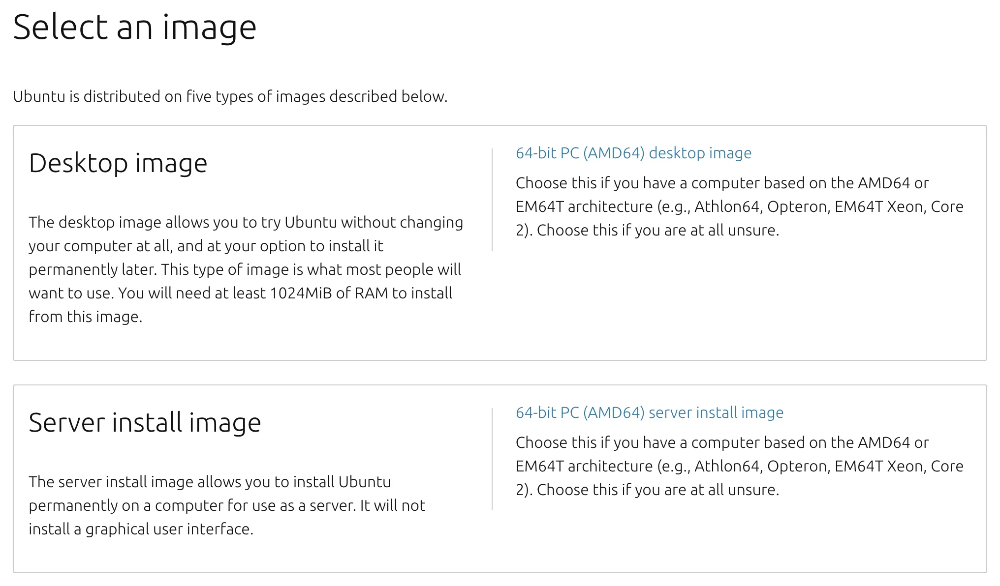
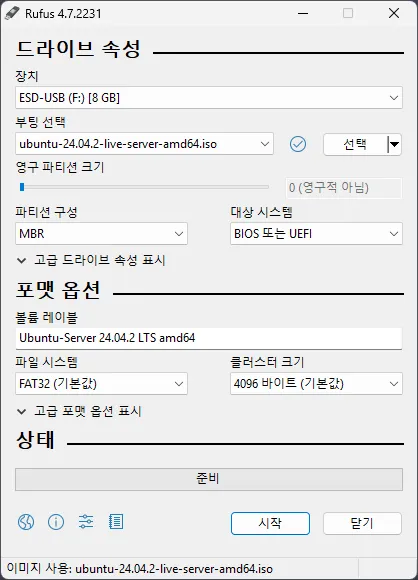
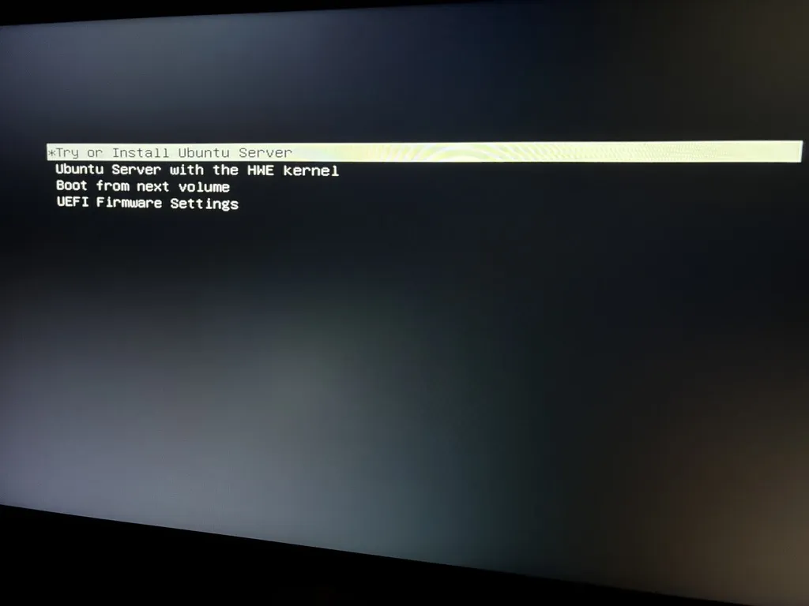
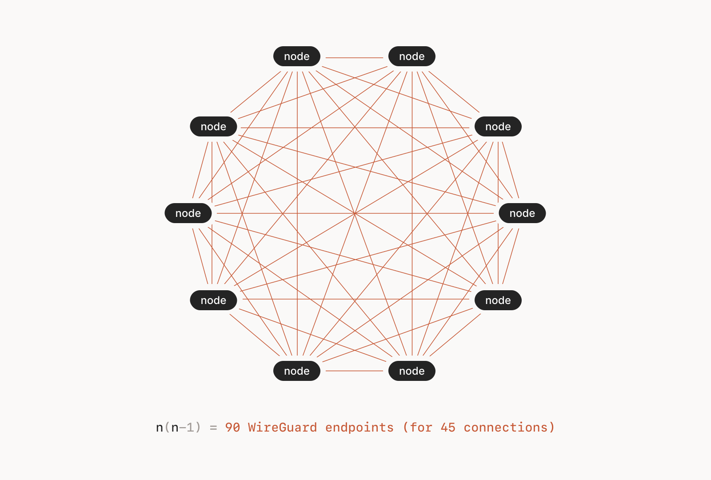
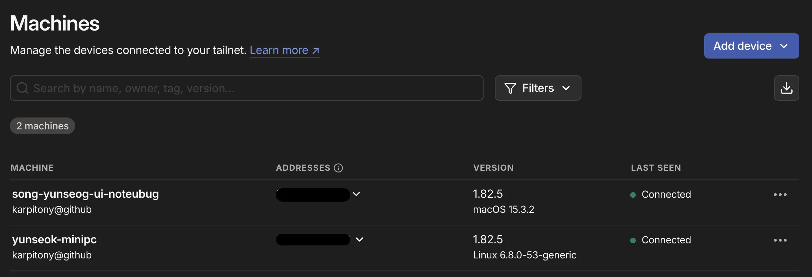

최근 홈서버를 하나 가볍게 운영해보고 싶었고, 마침 삼촌께서 안쓰는 미니 PC 한대를 주셨습니다.

첫 우분투 설치와 네트워크 설정, `Tailscale` 세팅까지 미니 PC 세팅 여정을 이야기 해보겠습니다.


## 1. Ubuntu Server 설치하기



https://releases.ubuntu.com/noble/

가장 최신 LTS인 `Ubuntu 24.04.2 (Noble Numbat)`을 설치해보았습니다. 서버로 쓸 미니 PC에 설치하기에 GUI는 필요없어 `Server install image`를 선택했습니다.

부팅 USB를 만들기 위해 오픈소스 프로그램인 `Rufus`를 설치했습니다. 이 프로그램은 윈도우 OS에서만 사용 가능합니다.

https://rufus.ie/ko/



설치한 우분투 서버 이미지 `.iso` 파일을 선택하고, USB도 잡아주면 끝납니다. 

포맷 옵션, 속성 등은 rufus 사이트의 예시 이미지를 참고하여 설정하였습니다. 위 옵션으로 잘 설치하였으니 참고해서 설치하시면 됩니다.



미니 PC에 부팅 USB를 꽂고 전원을 켜준 뒤 모니터에 뜨는 대로 하나씩 설정하면 됩니다.

연결한 모니터가 QHD라 글자가 너무 작아 따로 중간과정을 남기진 않았습니다.


## 2. 네트워크 연결 설정하기

여러 필수 패키지 설치를 위해 `sudo apt update`를 시도하였는데 네트워크가 잡혀있지 않아 업데이트에 실패했습니다.

```cmd
ubuntu@yunseok-minipc:~$ ip link
1: lo: <LOOPBACK,UP,LOWER_UP> mtu 65536 qdisc noqueue state UNKNOWN mode DEFAULT group default qlen 1000
    link/loopback 00:00:00:00:00:00 brd 00:00:00:00:00:00
2: enp2s0: <BROADCAST,MULTICAST,UP,LOWER_UP> mtu 1500 qdisc fq_codel state UP mode DEFAULT group default qlen 1000
    link/ether 7c:83:34:b8:79:5c brd ff:ff:ff:ff:ff:ff
3: wlp1s0: <BROADCAST,MULTICAST> mtu 1500 qdisc noop state DOWN mode DEFAULT group default qlen 1000
    link/ether 50:2f:9b:6c:ff:d9 brd ff:ff:ff:ff:ff:ff
```

미니 PC의 네트워크 초기화가 되지 않아 실패한 듯 보였습니다.

유선랜(`enp2s0`)과 무선랜(`wlp1s0`)이 있고, 유선랜을 꽂았지만, DHCP 설정등이 부족한 것 같았습니다.

`nmcli`나 `dhclient`를 사용해 네트워크를 설정하려 했지만, 둘 모두 깔려있지 않았습니다. 

인터넷을 연결하기 위해 패키지를 인터넷에서 설치해야 하는 상황에 직면했습니다. 우로보로스 같은 상황이 되어버렸습니다.

```sh
sudo ip link set enp2s0 up
sudo nano /etc/netplan/01-netcfg.yaml
```
```yaml
network:
  version: 2
  ethernets:
    enp2s0:
      dhcp4: true
```
```sh
sudo netplan apply
```

아까 유선랜인 `enp2s0`의 DHCP4 옵션을 true로 바꿔주었습니다.

```cmd
ubuntu@yunseok-minipc:~$ ping -c 4 8.8.8.8
PING 8.8.8.8 (8.8.8.8) 56(84) bytes of data.
64 bytes from 8.8.8.8: icmp_seq=1 ttl=115 time=33.4 ms
64 bytes from 8.8.8.8: icmp_seq=2 ttl=115 time=32.3 ms
64 bytes from 8.8.8.8: icmp_seq=3 ttl=115 time=33.0 ms
64 bytes from 8.8.8.8: icmp_seq=4 ttl=115 time=33.2 ms

--- 8.8.8.8 ping statistics ---
4 packets transmitted, 4 received, 0% packet loss, time 3004ms
rtt min/avg/max/mdev = 32.334/32.993/33.433/0.411 ms
```

직접 변경한 `netplan` 설정을 적용하고 구글 서버에 `ping`을 날려보니 정상적으로 응답을 받아왔습니다. 

```cmd
** (generate:12390): WARNING **: 21:47:13.631: Permissions for /etc/netplan/01-network-manager-all.yaml are too open. Netplan configuration should NOT be accessible by others.
```

하지만, `netplan` 설정 적용 시 권한 경고가 떴습니다. `netplan` 같은 중요한 파일의 수정 권한이 열려있는 것이 문제였습니다.

```cmd
root@yunseok-minipc:/etc/netplan# ls -l
total 4
-rw-r--r-- root root 75 May 17 08:43 01-netcfg.yaml
```
```cmd
root@yunseok-minipc:/etc/netplan# chmod 600 01-netcfg.yaml
root@yunseok-minipc:/etc/netplan# ls -l
total 4
-rw------- 1 root root 75 May 17 08:43 01-netcfg.yaml
```

권한 설정 명령어로 관리자에게만 read와 write 권한을 주는 `chmod 600`을 적용하고 다시 `netplan apply`를 시도하니 이제 경고가 뜨지 않게 됐습니다.


## 3. Tailscale 세팅

`Tailscale`은 `WireGuard`를 기반으로 동작하는 VPN입니다.
`WireGuard`는  오픈소스 VPN 프로토콜과 접속 프로그램이고, `Tailscale`이 위에 사용자가 직접 신경 쓸 필요 없이 기기 간 안전한 연결을 자동으로 구성해줍니다.




특히 인상적인 점은, 전통적인 VPN처럼 하나의 중앙 VPN 서버를 통해 연결되는 것이 아니라, 클라이언트끼리 직접 연결됩니다.

게다가 물론 밖으로 공개하려면 필요하겠지만, 기기간 연결을 위해서 별도로 포트를 열 필요가 없습니다!

집에 있는 미니PC, 노트북, 클라우드까지 하나의 네트워크에 있는 것처럼 통신할 수 있습니다. 


### 세팅법

https://tailscale.com/ 사이트로 이동하고 회원가입 후 절차대로 진행합니다.

맥의 경우 HomeBrew나 AppStore에서 설치 가능하고, 리눅스는 명령어로 설치 가능합니다.

```sh
curl -fsSL https://tailscale.com/install.sh | sh

sudo tailscale up
```

`tailscale up`을 입력하면 URL이 하나 주어지게 됩니다. 이 URL을 들어가 로그인하면 성공적으로 `tailscale`을 세팅하게 됩니다.



> https://login.tailscale.com/admin/machines

세팅 후 `Tailscale`의 대시보드를 확인하면 여러 기기가 등록된 것을 볼 수 있습니다. 제 맥(`song-yunseog-ui-notebug`)에서 미니PC로 접속하려면, `Tailscale` 앱을 실행시키고, 맥 터미널에서 바로 SSH를 연결시키면 됩니다.

```sh
ssh [리눅스 만들 때 id]@[tailscale 기기 이름]
ssh ubuntu@yunseok-minipc # 예시
```

이렇게 접속하면 정상 접속이 되며, 기초 세팅이 끝났습니다.

## 마무리

첫 리눅스 설치 및 세팅이라, 인터넷이 연결이 안되서 당황하기도 하고, 미니 PC 재부팅을 하며 부팅 USB를 제거하지 않아서 재설치하기도 했습니다.

그럼에도 프론트엔드만 하다 색다른 경험을 해보게 되었고, 앞으로 미니 PC를 어떤 용도로 사용할지 생각하니 기대가 되서 재밌었습니다.

미니 k8s를 설치하거나, nginx 세팅등을 배워야겠습니다.

읽어주셔서 감사합니다.
