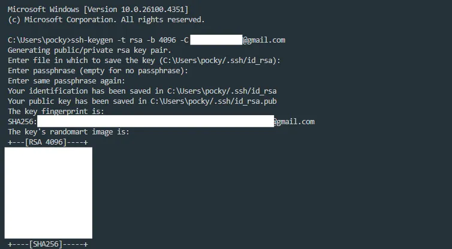
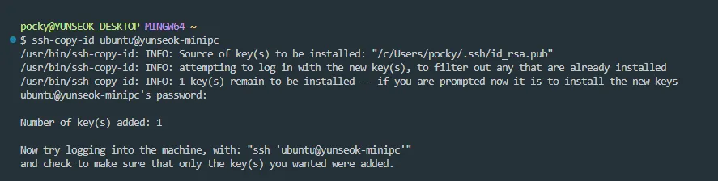

원격 리눅스 서버에 매번 비밀번호를 입력하지 않고 `ssh user@server` 한 줄로 로그인하고 싶다면, **RSA 공개키 기반 인증**을 설정해보는 것이 좋습니다.

윈도우의 경우 일부 명령어가 기본 CMD에서 작동하지 않기 때문에 `Git Bash`나 `WSL` 을 사용하는 것이 편하고, macOS는 기본 터미널에서 그대로 진행하면 됩니다.

## 1. RSA 키 쌍 생성하기

`ssh-keygen` 명령어로 ssh에 필요한 키 쌍을 생성할 수 있습니다.

- `-t rsa` 플래그로 키 타입을 RSA로 지정합니다.
- `-b 4096`으로 키의 비트수를 4096비트로 설정합니다.
- `-C` 플래그로 키 식별용 주석을 달 수 있습니다. 접속할 서버에 키들이 여러개 있을 때 주석을 통해 구분이 쉬워지므로 이메일 등을 설정하면 좋습니다.

```bash
ssh-keygen -t rsa -b 4096 -C "your_email@example.com"
```



경로는 기본값으로 `Enter`를 입력하면 되고,

- `~/.ssh/id_rsa`에 **개인키** (인증에 필요하며 공개하면 안되는 파일)
- `~/.ssh/id_rsa.pub` **공개키** (서버에 등록할 파일)

이렇게 두 파일이 생성됩니다. 이제 공개키를 접속할 서버에 등록하면 됩니다.

## 2. 공개키 등록하기

```bash
ssh-copy-id user@server
```



`Git Bash` 혹은 macOS 터미널에서 위 명령어를 실행하면, 해당 서버에 `~/.ssh/authorized_keys` 파일에 공개키가 자동으로 추가됩니다.

이후 SSH 접속을 시도하면 비밀번호 입력 없이 바로 접속이 가능합니다.

### 수동 복사하기

`ssh-copy-id` 명령이 작동하지 않거나 사용할 수 없는 환경이라면, 직접 공개키를 복사해서 서버에 등록할 수 있습니다.

**1. 먼저, 로컬에서 공개키 내용을 복사합니다.**

```bash
cat ~/.ssh/id_rsa.pub
```

**2. 그후 리눅스 서버에 로그인한 뒤, 아래 명령어로 `.ssh` 디렉토리를 만들고 권한을 설정합니다.**

```bash
mkdir -p ~/.ssh
chmod 700 ~/.ssh
```

> `700` 권한은 소유자만 읽기/쓰기/실행 가능한 권한입니다.

**3. 다음 중 하나의 방법으로 공개키를 `authorized_keys` 파일에 추가합니다.**

```bash
nano ~/.ssh/authorized_keys
# 또는
vi ~/.ssh/authorized_keys
```

> 위 편집기 중 편한 것을 골라 복사한 공개키 내용을 붙여넣고 저장하세요.
> 한 줄로 간단하게 붙여넣을 수도 있습니다.

```bash
echo "복사한_공개키" >> ~/.ssh/authorized_keys
```

**4. 공개키 파일에도 권한을 설정해줍니다.**

```bash
chmod 600 ~/.ssh/authorized_keys
```

> `600` 권한은 소유자만 읽기/쓰기 가능한 권한입니다.
> 다른 사용자나 그룹은 접근할 수 없어야 SSH가 인식합니다.
> 권한이 `644`처럼 너무 널널하면 SSH가 키를 무시할 수도 있습니다.

## 3. RSA 키쌍과 SSH 접속 원리

지금까지 설정한 SSH 공개키 인증은 RSA 암호화 방식을 이용한 **비대칭 키 인증 시스템**입니다.

비대칭 키 인증 시스템은 "공개키는 누구나 볼 수 있지만, 개인키 없이는 절대로 복호화가 불가능하다"는 특징이 있습니다.

키쌍의 구성은 다음과 같이 나뉩니다.

> - **공개키**: 리눅스 서버에 등록하는 키이며, 노출되어도 안전함
> - **개인키**: 내 컴퓨터에만 저장되는 비밀 키, 절대 외부에 유출되면 안됨

RSA 키 쌍을 통해 SSH 접속 시 다음 과정이 일어납니다.

> 1. SSH 클라이언트(로컬)가 서버에 접속 요청
> 2. 서버는 등록된 공개키를 바탕으로 암호화된 인증 메시지를 생성
> 3. 클라이언트가 자신의 개인키로 그 메시지를 정확히 복호화하면
> 4. 서버는 올바른 사용자임을 확인하고 로그인을 허용

비밀번호 없이도 로그인할 수 있지만, 개인키 없이는 절대 로그인할 수 없기 때문에 안전합니다.
