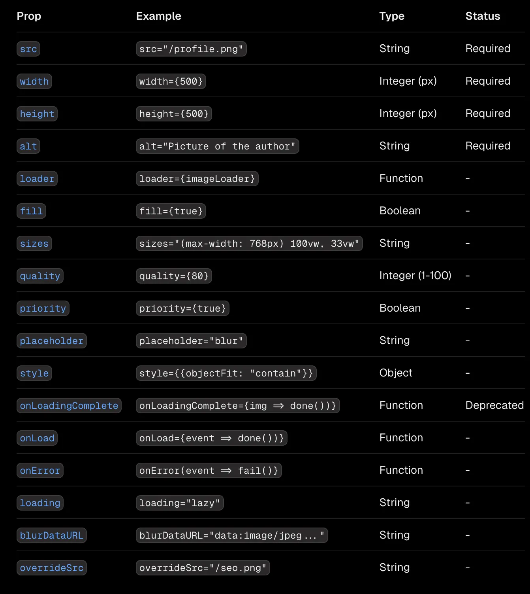
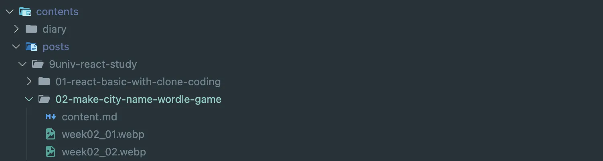
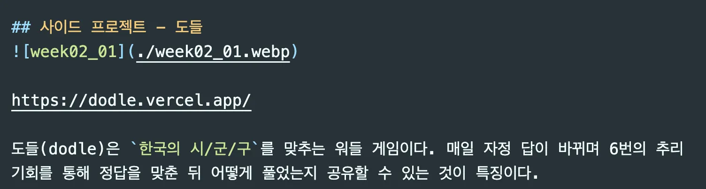
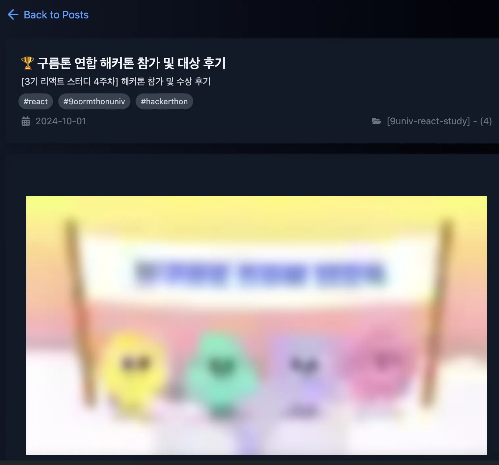

요새 유행하는 메타 프레임워크(`Next.js`, `Nuxt`, `SvelteKit`)들은 모두 **이미지 최적화**를 지원합니다.

그중에서 저는 React의 메타 프레임워크인 Next.js를 이용해 정적 블로그를 만들었습니다.

대부분의 페이지는 `next/image`를 사용해 이미지를 최적화 했지만, 마크다운을 파싱한 `/posts` 부분에선 `` 태그를 사용했고, 이부분이 조금 걸렸습니다.

마크다운 렌더에 이미지 최적화를 적용하며 찾은 이미지 최적화 컴포넌트의 장점, 사용 방법, 적용기를 풀어보겠습니다!


## `next/image`란?

> [Image Optimization - Next.js 공식문서](https://nextjs.org/docs/pages/building-your-application/optimizing/images)
> [Image Components - Next.js 공식문서](https://nextjs.org/docs/pages/api-reference/components/image)

next/image는 독특하게 동작합니다. 기본적으로 런타임에 최적화를 진행합니다.

사용자 화면 크기에 맞게 이미지를 자동으로 리사이즈하여, 필요한 크기만 로드됩니다. 

모바일에서는 작은 크기의 이미지가 로드되고, 데스크탑에서는 큰 이미지가 로드됩니다.

<br>

`next/image`는 이미지의 포맷을 최적화된 형태로 자동으로 변환합니다.

이미지를 `webp` 혹은 `avif` 포맷 등 용량이 작고 품질은 그대로인 포맷중 하나를 골라 변환합니다. 

브라우저가 지원하는 최적의 포맷으로 자동 변환합니다.


별도의 설정을 하지 않을 경우 75% 퀄리티로 이미지를 렌더하고, lazy 로딩이 적용됩니다.


### 로컬 이미지 최적화 

```tsx
import Image from 'next/image'
import profilePic from '../public/me.png'
 
export default function Page() {
  return (
    <Image
      src={profilePic}
      alt="Picture of the author"
      // width={500} automatically provided
      // height={500} automatically provided
      // blurDataURL="data:..." automatically provided
      // placeholder="blur" // Optional blur-up while loading
    />
  )
}
```

로컬에서 이미지를 임포트할 경우 **크기, 높이 지정이 필요없고**, 별도의 blurDataURL없이도 `placeholder="blur"` 프롭 활성화를 통해 블러 이미지를 제공합니다.

다만 마크다운 렌더링의 경우 로컬 임포트가 아니라 동적 임포트이기에 이부분에 추가작업이 필요합니다.

그 내용은 글 아래에서 다뤄보겠습니다.


### Remote 이미지 최적화

로컬에 있는 이미지만 최적화할 수 있는게 아닙니다.

원격 이미지도 `next.config.js` 설정을 통해 최적화 할 수 있습니다.

```tsx
// next.config.js
export default const nextConfig = {
  images: {
    remotePatterns: [
      {
        protocol: 'https',
        hostname: 'raw.githubusercontent.com',
      },
    ],
  },
};
```

```tsx
import Image from 'next/image'
 
export default function Page() {
  return (
    <Image
      src="https://raw.githubusercontent.com/karpitony/9oormthonUniv-React-Study/refs/heads/main/img/week04/week04_03.webp"
      alt="뜬구름"
      width={500}
      height={500}
    />
  )
}
```

다만, 이경우 `next/image`가 이미지의 사이즈를 미리 추측할 수 없기에 `width`와 `height` 값을 지정해줘야 합니다.

이미지를 불러온 후 width와 height에 맞게 이미지가 리사이징 됩니다.



기본 ``태그의 래퍼답게 여러 기능들을 제공하고 있습니다.

이중 주요 기능들을 보면
- `width`, `height` 속성으로 이미지 로딩 전 공간을 차지하고 있어 화면 움찔걸미(레이아웃 시프트)를 방지합니다.
- `placeholder`를  통해 로딩 전 가벼운 블러 이미지 등을 보여줄 수 있습니다.
- `loading` 속성에서 `loading="lazy"`를 통해 lazy로딩을 손쉽게 사용하여 초기 로딩 속도를 줄일 수 있습니다.

그밖에도 로딩중이나 에러 헨들링도 쉽게 가능합니다.


## 블로그에 `next/image` 적용하기



제 블로그에선 게시글 폴더 구조를 다음과 같이 잡았습니다.

`contents/posts/[시리즈 제목]/[글 제목]`이고 그 안에 `content.md`인 마크다운 게시글과 게시글에 필요한 이미지가 들어있습니다.



마크다운 안에서는 위 사진의 `./markdown-image.webp`처럼 상대경로로 이미지를 불러옵니다.

이 경로를 그대로 마크다운 렌더에 넣게 되면 에러가 나게 됩니다.

이를 해결하기 위해 몇가지 방법들이 있습니다.


### 시도 1) `.mdx` 사용하기

MDX는 MarkDown wit JSX의 약자로, 마크다운과 컴포넌트를 같이 쓰는 파일 형식입니다. 

리액트 컴포넌트를 사용하므로, Markdown의 간결함과 React의 강력함을 활용할 수 있습니다.

다만, mdx를 처음 써보기도 하고, 매번 `<Image />` 컴포넌트의 옵션들을 설정해야 할 것 같아서, 마음에 들지 않았습니다.

그리고 제 게시글이 특정 문법에 종속되는게 싫었기에, 대부분이 지원하는 마크다운 표준 문법만 사용하고 싶었습니다.


### 시도 2) `/public` 폴더에 이미지 보관

웹에선 `/`으로 시작하는 URL을 통해 `/public` 폴더의 에셋에 접근할 수 있습니다.

``와 같이 `/`으로 시작하는 이미지 경로는 마크다운 미리보기에서 이미지를 볼 순 없지만, 빌드 후 이미지를 불러올 수 있어, 지금의 문제를 해결할 수 있어보였습니다.

하지만 이 방법 역시 다음과 같은 문제점이 있었습니다.

이미지와 게시글이 분리되어 있으면, 추후 블로그 이사나 게시글 보관이 힘듭니다.

게시글 작성시 직관성과 응집도도 떨어질것 같습니다.

<br>

대중적인 방법들이 마음에 안들면 몸이 고생해야 합니다...

GPT와 열띤 토론 끝에 세번째 방법을 고안했고, 나름 만족하고 있습니다.


### 시도 3) 이미지를 `/public`으로 복사 후 추가 JSON 파일 생성

게시글 작성 시에는 `contents/posts/[시리즈]/[글제목]/` 폴더 안에서 상대 경로에 이미지를 저장해서 마크다운에서 상대경로로 불러오고, `next dev`, `next build`으로 빌드 시 사전 실행 스크립트를 작동 시켜 이미지들을 퍼블릭으로 복사했습니다.

마크다운 렌더 안 `<Image />` 컴포넌트에 사전 정보(width, height)를 제공하기 위해 이미지 데이터를 별도의 JSON으로 저장했습니다.

<br>

가벼운 블러 이미지를 보여주고, lazy 로딩을 하고 싶었기에 블러 URL 데이터도 필요했습니다.

```ts
import sizeOf from 'image-size';
import sharp from 'sharp';
//...
  const fileBuffer = fs.readFileSync(fullPath);

  const dimensions = sizeOf(fileBuffer);
  if (!dimensions.width || !dimensions.height) continue;

  const blurBuffer = await sharp(fileBuffer)
    .resize(80, 60, { fit: 'inside' })
    .webp({ quality: 30 })
    .toBuffer();

  const base64 = blurBuffer.toString('base64');
  const blurDataURL = `data:image/webp;base64,${base64}`;

  imageInfo[target][relPath.replace(/\\/g, '/')] = {
    width: dimensions.width,
    height: dimensions.height,
    blurDataURL,
  };
// ...
```

이를 위해, 위와 같은 스크립트를 작성했습니다.

`image-size` 패키지를 활용해 이미지 가로/세로를 측정했고, Next.js가 권장하는 `sharp` 라이브러리를 활용하여 80x60 크기의 가벼운 블러 이미지 URL을 만들었습니다.

```tsx
<ReactMarkdown
  className= // ...
  components={{
     //...
    },
    img({ src, alt }) {
      let resolvedSrc = src || '';
      let width = 1200;
      let height = 800;
      let blurDataURL: string | undefined = undefined;
      // 글 폴더 안에 이미지가 있는 경우만 
      const blurImageFlag = 
        resolvedSrc.startsWith('./') || resolvedSrc.startsWith('../') ? true : false;

      if (blurImageFlag) {
        if ( series && postTitle) {
          const relPath = `${series}/${postTitle}/${resolvedSrc.slice(2)}`;
          resolvedSrc = `/contents/posts/${relPath}`;
          const size = imageInfo.posts[relPath as keyof typeof imageInfo.posts];
          
          if (size) {
            width = size.width;
            height = size.height;
            blurDataURL = size.blurDataURL || undefined;
          } else {
            Logger.warn('[Image] image-info.json에 해당 이미지 정보 없음:', relPath);
          }
        } else {
          Logger.warn('[Image] series나 postTitle이 없어 이미지 경로를 만들 수 없습니다.');
        }
      }
      return (
        <Image
          src={resolvedSrc}
          alt={alt || 'image'}
          width={width}
          height={height}
          placeholder={blurImageFlag ? 'blur' : 'empty'}
          blurDataURL={blurDataURL}
          loading='lazy'
          style={{
            // ...
          }}
        />
      );
    },
  }}
>
  {markdownText}
</ReactMarkdown>
```

`<ReactMarkdown />` 마크다운 렌더 안 img: 옵션에 `next/image`의 이미지 컴포넌트를 넣고, 이미지 제목에 따라 이미지에 해당하는 width, height를 넣어주고,

미리 만든 blurDataUrl도 같이 적용해주었습니다.

<br>



이미지가 갑자기 나타는 것이 아닌, 블러 이미지가 먼저 보이고, 로드 후 고화질 이미지로 대체됩니다.

---

## 결론

기존에는 HTML의 기본 img태그를 사용했기에 이미지 최적화, 레이아웃 밀림, 로딩 전략 등에서 한계가 있었습니다.

살짝 복잡한 과정과, 사전 빌드 스크립트가 필요하긴 했지만, Next.js의 `Image` 컴포넌트로 교체한 후 지연 로딩(Lazy Loading), 레이아웃 안정화, 기기 해상도에 맞게 자동 리사이징 등의 장점을 얻을 수 있었습니다.

